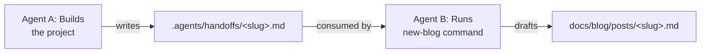

# Sanji Blog — Agent Framework

This directory contains conventions and tooling for maintaining consistent blog posts on the Sanji site.

## Files

| File | Purpose |
|------|---------|
| `.agents/rules/blog-rules.md` | All writing conventions: front matter, tone, code blocks, images, secrets, OP theming, trivia, handoff docs |
| `.agents/patterns/blog-patterns.md` | Post architecture templates (Technical Guide, Character Analysis, Extension, Rant + One Piece) |
| `.agents/skills/write-blog-post.md` | Step-by-step workflow for generating a new post |
| `.agents/commands/new-blog.md` | Executable workflow for creating posts, optionally from handoff docs |
| `.agents/handoffs/` | Directory for handoff docs — Agent A drops project notes here, Agent B consumes them |

## Critical Rules

- **Never use real-looking tokens or secrets in examples** — always `YOUR_BOT_TOKEN`, `YOUR_API_KEY`, etc.
- Always run `uv run poe build` before committing a new post
- Place images in `docs/assets/images/<blog|projects>/<slug>/` before referencing them
- Image paths are relative: `../../assets/images/<blog|projects>/<slug>/file.jpg`
- Author is always `prateek11rai` (configured in `docs/blog/.authors.yml`)
- Every post needs One Piece intro image + closing image + one thematic reference (minimum)
- Handoff docs decouple project work from blog writing — use `.agents/handoffs/<slug>.md`
- **No `Co-Authored-By` trailers on commits, and no AI attribution in PR descriptions** — do not add "Generated with Claude Code", "Created using Claude Code", or similar co-author/footer lines. Commits and PRs are authored solely by the owner.

## Workflow with Handoff Docs

