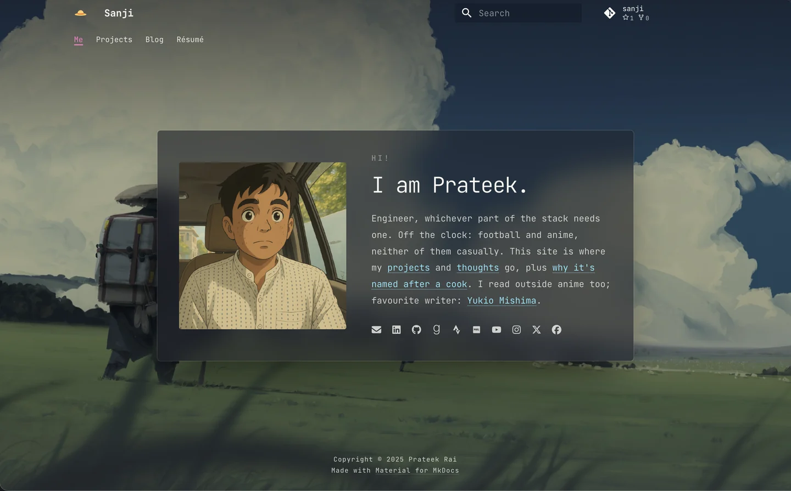

# Sanji

A personal site, named after the Straw Hats' cook.

**Live at** <https://prateek11rai.github.io/sanji/>



> Refresh after a redesign — screenshot the homepage, then
> `cwebp -q 86 shot.png -o .github/assets/homepage.webp`. The conversion matters:
> a retina PNG is a few MB, and this lands in git history every time.

---

## Sections

Defined by `nav` in `mkdocs.yml` — that is the list, not this one.

| | |
|---|---|
| **Me** | The homepage. A template override rather than a Markdown page in a content well. |
| **Projects** | One page per project. |
| **Blog** | Posts, tagged and categorised, syndicated to dev.to. |
| **Résumé** | A page. |

## Stack

[MkDocs](https://www.mkdocs.org/) with [Material for MkDocs](https://squidfunk.github.io/mkdocs-material/),
built and run through [uv](https://docs.astral.sh/uv/) and
[poethepoet](https://poethepoet.natn.io/). Deployed to GitHub Pages by a
workflow in `.github/workflows/`.

Every version is pinned in `pyproject.toml`; plugins, palette, type and nav are
all declared in `mkdocs.yml`. Neither is restated here, so neither can drift out
of sync with it.

## How it works

The parts that are not obvious from the file tree:

- **The homepage is a template override.** `overrides/home.html` renders its
  hero inside `` after `super()` — that block *is* the nav bar,
  so calling `super()` first is what keeps Material's real header, search and
  repo link. Its stylesheet loads from `extrahead`, never `extra_css`, because
  it hides `.md-content` and that would blank every other page.

- **Nothing on the homepage is hardcoded.** Sections come from `nav`, socials
  from `extra.social`, the copy from `docs/index.md`, the backdrop and avatar
  from `extra.home`. Adding a section or a social link is a config change.

- **The avatar is fetched from its source, never committed**, so it tracks
  whatever is on the profile.

- **Backdrops are generated, not hand-cropped.** One command produces a desktop
  crop, a separate portrait crop for phones, and a pre-dimmed social card, each
  as AVIF with a WebP fallback. The untouched original is kept beside them and
  excluded from the build.

- **Posts syndicate to dev.to** from a workflow, with canonical URLs pointing
  back here.

## Running it

```bash
git clone https://github.com/prateek11rai/sanji.git
cd sanji
brew install uv cairo
uv sync --all-groups --all-extras --upgrade
uv run poe serve
```

Open <http://127.0.0.1:8000/sanji/>, then `^C` to stop.

`cairo` is required by Material's `imaging` extra, which generates the social
cards. The build fails without it.

## Commands

| Command | What it does |
|---------|--------------|
| `uv run poe serve` | Dev server with live reload |
| `uv run poe build` | Build the static site to `site/` |
| `uv run poe backdrop <image>` | Regenerate the homepage backdrop and social-card crops |

`poe backdrop` takes `--zoom` and `--focus` to reframe, and `--narrow-source`
if the phone crop deserves its own image. It refuses quietly to nothing and
warns loudly when a source is too small to crop without upscaling.

## Layout

```text
docs/            content: pages, posts, images
  extra/css/     palette and page-specific styles
overrides/       template overrides
scripts/         build-time tooling
.github/         workflows and README assets
```

<details>
<summary><strong>First-time machine setup (macOS)</strong></summary>

### Xcode Command Line Tools

```bash
xcode-select --install
```

### Homebrew

```bash
curl -fsSL https://raw.githubusercontent.com/Homebrew/install/HEAD/install.sh | bash

# Add to ~/.zshrc:
export PATH=/usr/local/bin:$PATH

source ~/.zshrc
```

### Python via pyenv

The pinned version is in `pyproject.toml` under `requires-python`.

```bash
brew install pyenv
```

Add to `~/.zshrc`:

```bash
export PYENV_ROOT="$HOME/.pyenv"
[[ -d $PYENV_ROOT/bin ]] && export PATH="$PYENV_ROOT/bin:$PATH"
eval "$(pyenv init -)"
```

```bash
source ~/.zshrc
pyenv install "$(sed -n 's/^requires-python = "==\(.*\)"/\1/p' pyproject.toml)"
pyenv global "$(sed -n 's/^requires-python = "==\(.*\)"/\1/p' pyproject.toml)"
```

</details>
