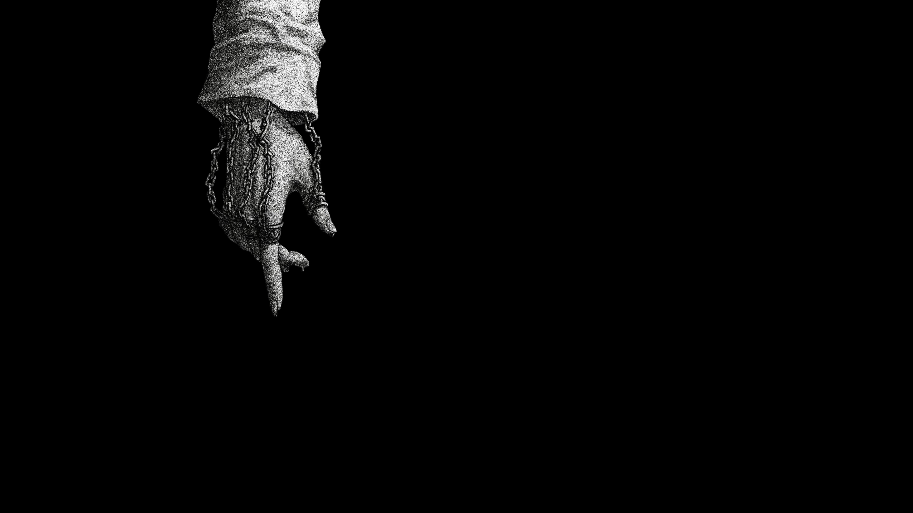
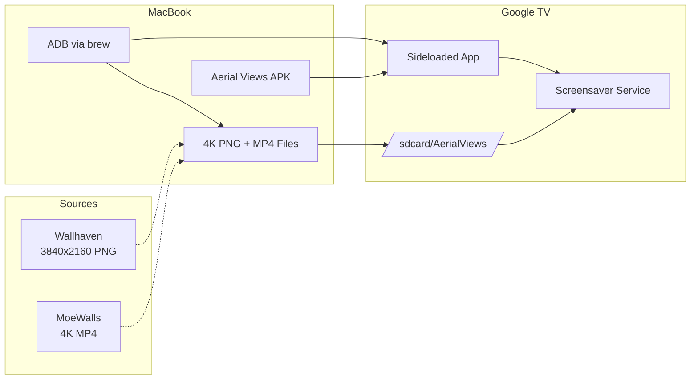

---
authors:
    - prateek11rai
categories:
  - Android
  - Homelab
tags:
  - android
  - homelab
  - screensaver
  - google
date: 2026-05-17
draft: false
---

# Freeing the Screensaver: 4K Anime Art on Google TV

My TV spends more time idle than playing content. And every idle minute, Google TV shows me the same curated AI art or Google Photos memories — things I did not choose, do not control, and cannot change.

I wanted my own screensaver. 4K anime art from Wallhaven, video loops from MoeWalls — playing on my TV, not streamed from a cloud service I never asked for.[^1]

[^1]: Image credits and attribution — please [contact](mailto:prateek11rai@protonmail.com) if anything needs updating.

{ loading=lazy }

<!-- more -->

## The Problem

Since Android TV 12, Google TV devices have locked down the screensaver selection. The Settings UI no longer lists third-party screensaver apps. You get Ambient Mode — Google Photos, AI art, or a black screen. That is it.

The change affected every Google TV device: Chromecast with Google TV, Google TV Streamer, and built-in Google TV on Sony, TCL, and Philips TVs.

## The Solution

[Aerial Views](https://github.com/theothernt/AerialViews) is an open-source screensaver app that supports 4K HDR videos, local photos, and media from USB/Samba/WebDAV. It is on the Play Store, but Google TV hides it from the launcher. You install it anyway via ADB and force the system to use it.

The full pipeline:



### 1. Enable Developer Options on the TV

```text
Settings → Device Preferences → About → Build → click 7 times
Settings → System → Developer options → USB debugging → ON
```

Note down the TV's IP address: `Settings → Network → Wi-Fi → IP address`.

### 2. Install ADB

```bash
brew install android-platform-tools
adb version
```

### 3. Connect to the TV

```bash
adb connect <TV_IP>:5555
```

If the connection is refused (common on Android 14+ Chromecast with Google TV):

1. Go to **Developer options → Wireless debugging** on the TV
2. Select **Pair device with pairing code**
3. Run the pair command shown on TV, then connect:

```bash
adb pair <IP>:<PORT>   # enter the 6-digit code
adb connect <IP>:<PORT>
```

### 4. Download and Install Aerial Views

```bash
curl -LO https://github.com/theothernt/AerialViews/releases/download/1.8.2/aerial-views-1.8.2.apk
adb install aerial-views-1.8.2.apk
```

### 5. Set It as the System Screensaver

This is the critical step — it bypasses Google TV's UI lock:

```bash
adb shell settings put secure screensaver_components \
  com.neilturner.aerialviews/.ui.screensaver.DreamActivity

# Verify
adb shell settings get secure screensaver_components
# Expected: com.neilturner.aerialviews/.ui.screensaver.DreamActivity
```

### 6. Push Your Own Media

```bash
# Create a folder on the TV
adb shell mkdir -p /sdcard/AerialViews

# Push 4K images and videos
adb push ~/Downloads/wallhaven/*.png /sdcard/AerialViews/
adb push ~/Downloads/moewall/*.mp4 /sdcard/AerialViews/

# Verify
adb shell find /sdcard/AerialViews -type f
```

### 7. Configure Aerial Views on the TV

Open the Aerial Views app from the app drawer and configure:

1. **Sources → Local storage**
   - Mode: **Folder access**
   - Path: `/AerialViews`
   - Ensure only one volume is selected

2. **Playlist** — disable ALL online sources (Apple, Amazon, Jetson Creative, Robin Fourcade). Enable only **Local storage**
   - Set **Media type**: Mixed or Photos only
   - Adjust **Photo duration** to your preference

3. **Overlays** (optional) — clock, date, location

4. **Back → Test screensaver** to preview

## Where to Find 4K Anime Media

Google TV is 16:9 4K, so aim for **3840×2160** content:

| Site | Type | Notes |
|------|------|-------|
| [Wallhaven](https://wallhaven.cc) | Images | 4K PNG, best for anime art, bans AI art |
| [DesktopHut](https://desktophut.com) | Video loops | Free 4K MP4, anime/gaming/nature |
| [MoeWalls](https://moewalls.lat) | Video loops | Anime-focused 4K MP4/WEBM, free |
| [Pixabay](https://pixabay.com/videos/search/anime%20background/) | Videos | 15K+ free backgrounds, 4K, royalty-free |

## The Current Setup

My TV now cycles through a mix of 4K Wallhaven images and a video loop from MoeWalls — about 151 MB of local content that plays regardless of internet connectivity.

```text
/sdcard/AerialViews/
├── wallhaven-je86dy_3840x2160.png
├── wallhaven-d86o9g_3840x2160.png
├── wallhaven-6llg7q_3840x2160.png
├── ...                # 8 more images
└── moewalls/
    └── cat-in-the-swamp-moewalls-com.mp4
```

## Quick Reference

| Action | Command |
|--------|---------|
| Connect | `adb connect <IP>:5555` |
| Pair (if needed) | `adb pair <IP>:<PORT>` |
| Install APK | `adb install app.apk` |
| Push files | `adb push <local> <remote>` |
| Set screensaver | `adb shell settings put secure screensaver_components com.neilturner.aerialviews/.ui.screensaver.DreamActivity` |
| Restore default | `adb shell settings put secure screensaver_components com.google.android.apps.tv.dreamx/.service.Backdrop` |
| Change idle timeout | `adb shell settings put system screen_off_timeout 300000` |

The fix took 15 minutes. Most of that was downloading wallpapers. The TV sits idle, and now it shows exactly what I want — no cloud, no AI, no algorithm.
