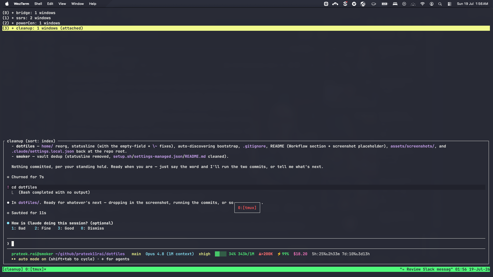
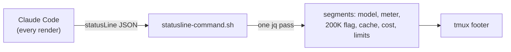
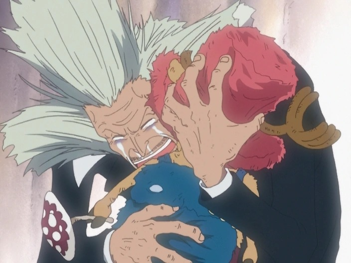

---
authors:
    - prateek11rai
categories:
  - Tooling
  - AI
tags:
  - claudecode
  - terminal
  - tokens
  - monitoring
date: 2026-07-19
draft: false
---

# Building a Vitals Monitor for Claude Code

A Slack thread about our climbing AI bill, plus word that per-user usage limits were landing soon, sent me to check what I was actually spending on Claude Code. The answer was that I had no idea.

The cost only showed up after the fact, in a dashboard I never opened. So I built a gauge instead. My terminal footer now reads out the session's vitals on every render, and the whole thing is one shell script.

{ loading=lazy }

<!-- more -->

In a hurry? [Skip to what the line shows](#what-i-watch-and-why-each-segment-earns-its-place).

## What the status line gets to see

Claude Code pipes a JSON blob to whatever you register as its `statusLine` command, once on every render. My script reads that blob with a single `jq` pass and prints one line back. Claude Code renders each stdout line as its own status row, so I get to decide exactly what sits under the prompt.

Registering it is two lines in `~/.claude/settings.json`:

```json
{
  "statusLine": {
    "type": "command",
    "command": "bash ~/.claude/statusline-command.sh"
  }
}
```

The whole script is one pass over the JSON. Here is the field extraction, trimmed to the parts that matter:

```bash
# One jq pass over the JSON Claude Code pipes in on every render.
echo "$input" | jq -r '[
  (.model.display_name                       // ""),
  (.context_window.used_percentage           // "" | tostring),
  (.context_window.total_input_tokens        // "" | tostring),
  (.context_window.context_window_size       // "" | tostring),
  (.cost.total_cost_usd                      // "" | tostring),
  (.rate_limits.five_hour.used_percentage    // "" | tostring),
  (.rate_limits.seven_day.used_percentage    // "" | tostring),
  (.exceeds_200k_tokens                      // false | tostring),
  (.effort.level                             // "" | tostring)
] | join("\u001f")'
```

That `\u001f` is a unit separator, not a tab. Tab is IFS whitespace, so `read` would collapse the empty fields and shift every value one slot to the left. The rate-limit and usage fields are absent early in a session, so empty fields are the normal case, not the edge case. Learned that one the hard way.

## What I watch, and why each segment earns its place

Every segment has to justify the pixels. Here is the full line and what each part answers.

| Segment | Reads from | Why it's on screen |
|---|---|---|
| `Opus 4.8 (1M context)` | `model.display_name` | Which model and window I'm on, without guessing |
| `xhigh` | `effort.level` | High effort burns output tokens fast; seeing it nudges me to dial down for cheap tasks |
| `▓▓░░░ 34% 343k/1M` | `context_window.*` | How full the window is. Near the top means auto-compaction is close, and per-turn cost is climbing |
| `⚠>200K` | `exceeds_200k_tokens` | This request's input crossed 200K tokens (see below) |
| `⚡99%` | `context_window.current_usage.*` | Share of input served from cheap cache reads instead of full-price fresh input |
| `$18.20` | `cost.total_cost_usd` | Dollars this session |
| `5h:25%↻2h33m 7d:10%↻3d13h` | `rate_limits.*` | Rolling rate-limit usage and time until each window resets |

The meter is a five-slot bar that goes green under 50%, yellow through 79%, red at 80% and up. The cache indicator is computed, not read: `cache_read / (input + cache_creation + cache_read)`, colored the same way. A low number there means I'm paying full input price every turn, which is real money on a long session.

In a narrow tmux split the line wraps to two rows and starts shedding segments in a fixed order: effort, then limits, then cache, then the token fraction, then cost. The `⚠>200K` warning is never dropped. It's the one thing I never want to lose sight of, for reasons in the next section.

## The two costs that surprise people

There are two different cost mechanisms in play, and the line treats them as separate things because they are.

The first is the long-context tier. The `⚠>200K` flag comes straight from the `exceeds_200k_tokens` boolean, and it lights up when a single request's input crosses 200K tokens. On the models that carry a long-context pricing tier, that's the point where input past 200K starts billing at a higher per-token rate. The honest caveat: at the time of writing, the current Opus (Opus 4.8, 1M context) bills the whole window at standard rates with no long-context premium. So treat the flag as "you're in long-context territory, go check what your model charges here," not a guaranteed price jump. [Anthropic's pricing](https://www.anthropic.com/pricing) is the source of truth, and these tiers move.

The second is plan-level "extra usage," and it's what the 5h/7d segments are really about. Those track rolling usage against the plan's rate limits. On Team plans with spillover enabled, usage past the included allotment bills at API rates, roughly 4–5× the effective included rate at the time of writing. The status line can't show a dollar figure for it, because there is no field for it in the JSON. The percentages and reset countdowns are the proxy: `5h:25%↻2h33m` means I'm a quarter into the five-hour window with 2h33m until it resets.

!!! quote "Hot Take"
    Cost is the number everyone watches and it's the wrong one to watch alone. Crossing the 200K threshold and burning down a rate-limit window are leading indicators; the dollar figure is the lagging one that arrives after the decision that caused it. The reset countdown turned rate limits from an invisible ceiling into something I can pace against.

## Reading the line at a glance

Here it is in the wild: a minimal WezTerm window, tmux doing the multiplexing, and the footer carrying the whole story.

{ loading=lazy }

Bottom row, left to right: identity and branch, then `Opus 4.8 (1M context)`, `xhigh`, the context meter at `34% 343k/1M`, `⚠>200K` lit (343k is well past the threshold), `⚡99%` cache hits, `$18.20` spent, and the two reset clocks. One glance and I know where the session stands before I fire off the next expensive turn.

## Why I kept my own script

Before committing to this, I compared it against `ccstatusline`, the popular off-the-shelf option. The deciding factor was where the data lives.

The `statusLine` JSON hands you almost everything worth showing for free: model, effort, context, cost, cache, rate limits. The one thing it has no field for is an extra-usage or overage dollar figure. `ccstatusline` fills that gap by calling a separate Usage API. I didn't want the dollar figure badly enough to take on a second data source and its auth, so I kept the script and just added the fields it was missing.

!!! tip "Trivia"
    The reason a pure status-line script can't show your overage in dollars is that the `statusLine` JSON simply doesn't expose it. You get the 5h/7d percentages and reset times, but the overflow spend lives behind a different API. That single missing field is the whole reason tools like `ccstatusline` reach outside the JSON.

## rtk, the token saver that briefly lied to me

Separate from the status line, but part of the same "spend the context window on thinking, not scrollback" goal, I run `rtk` (Rust Token Killer). It's an output-compression proxy wired in as a Claude Code PreToolUse Bash hook (`rtk hook claude`). It squeezes the command output that flows back into the model's context — long `git log`, directory listings, build dumps — so scrollback doesn't eat the window.

It works. It also bit me this session. `rtk` was aggressive enough to collapse my own diagnostic output: a `wc -l` came back `0`, an `ls -la` came back `(empty)`, and for a minute I was convinced real commands were failing. They weren't. The hook had compressed the output to nothing before I ever saw it. The fix was to redirect to a file and read the file directly, bypassing the hook entirely.

You can catch it happening in the screenshot above, where a `cd dotfiles` reads `Bash completed with no output`. A token-saver that hides real output is a trade-off, and I'd rather say that plainly than pretend it's free.

## How the pieces fit



Claude Code renders, pipes the JSON, the script parses it once and prints, tmux shows it. No daemon, no polling, no state. It recomputes from scratch on every render, so what you see is always the current session, with no cached numbers to go stale.

## What it changed

The line changed how I work more than I expected. I match effort to the task now instead of leaving `xhigh` on for a one-line edit. I keep the prompt prefix stable so the cache-hit rate stays high. I pace long runs against the reset clock instead of running into a wall I couldn't see. None of that is new information — it was all available before, in a dashboard, after the fact. Putting it under the cursor is what made me act on it.

The script and its install live in my [dotfiles](https://github.com/prateek11rai/dotfiles), symlinked and set up by the bootstrap only when the `claude` CLI is present.[^1]

---

Chopper is the Straw Hats' doctor. He doesn't wait for a crewmate to drop mid-fight; he watches their vitals and calls it early. That's what this footer is — a vitals monitor for the session, taking its pulse on every render. And when the window gets tight there's a bit of Sanji in it too: rationing a limited pantry so nothing goes to waste, which is the entire job of `rtk` and, fittingly, the name over the door of this blog.

Chopper only became that doctor because Dr. Hiriluk, the quack everyone laughed at, believed in him first.

{ loading=lazy }

[^1]: Intro and closing images are from the One Piece anime via the [One Piece Wiki](https://onepiece.fandom.com/): the [intro portrait of Chopper](https://onepiece.fandom.com/wiki/File:Tony_Tony_Chopper_Anime_Post_Timeskip_Infobox.png) and the closing scene of [Dr. Hiriluk and Chopper](https://onepiece.fandom.com/wiki/File:Hiriluk_Hugs_Chopper.png). Attribution and credits — please [contact](mailto:prateek11rai@protonmail.com) if anything needs updating.
