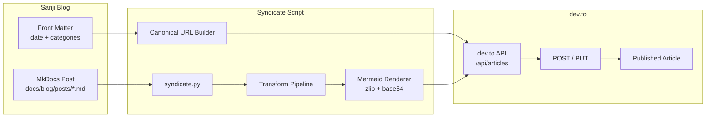

---
authors:
    - prateek11rai
categories:
  - Tooling
date: 2026-06-28
draft: false
---

# Your Blog Deserves a Second Life: Syndicating to dev.to with Canonical URLs

I spent months writing posts for this blog. Each one went live on the site, got maybe three readers (one of them me checking the RSS feed), and sat there in peace.

Then I started copy-pasting the same content to dev.to manually — fixing broken image paths, stripping out MkDocs-specific markdown, re-pasting. Every. Single. Post.

The third time I did it, I wrote a Python script instead. That script became a CI pipeline. That pipeline became the subject of this post.[^1]


<!-- more -->

## The Canonical URL Problem

Here is the thing that kept me up at night: dev.to has a domain authority of 89. Your personal blog has a domain authority of about 4 (if you are lucky). If you post the same content on both without telling Google which one is original, guess which one ranks first?

**Hint: not yours.**

This is where `canonical_url` comes in. It is an HTML `<link>` tag that tells search engines: "This article originally lives at this URL. Index that one, not me." dev.to supports it natively — if you include `canonical_url` in your API payload, every dev.to article page renders a `<link rel="canonical" href="...">` in the head. Google sees it and credits the original source.

Without canonical URLs, dev.to syndication actively harms your SEO. With them, it becomes a pure distribution channel — your site keeps the ranking, dev.to gets the traffic.

!!! quote "Hot Take"
    If you syndicate to dev.to without setting a canonical URL, you are actively cannibalizing your own SEO. dev.to's domain authority means Google will rank their copy above yours every time. Canonical URLs are not a nice-to-have — they are the difference between syndication helping you and hurting you.

The canonical URL for this very post? `https://prateek11rai.github.io/sanji/blog/2026/06/28/devto-syndication/`. The script builds it from the front matter date and the slug.

## The dev.to API

The dev.to API is refreshingly simple. No OAuth flow, no Bearer tokens, no scopes to negotiate. You generate an API key from `dev.to → Settings → Account → API Keys` and send it as a header.

### Authentication

```text
api-key: YOUR_DEVTO_API_KEY
Content-Type: application/json
```

That is it. One header. No `Authorization: Bearer`, no refresh tokens.

### The Payload

The entire payload nests under a single `article` key:

```json
{
  "article": {
    "title": "Your Blog Deserves a Second Life",
    "body_markdown": "# The full markdown content...",
    "published": true,
    "canonical_url": "https://prateek11rai.github.io/sanji/blog/2026/06/28/devto-syndication/",
    "description": "Short excerpt shown in previews",
    "tags": ["tooling", "python", "meta"],
    "main_image": "https://raw.githubusercontent.com/prateek11rai/sanji/main/docs/assets/images/devto-syndication/devto-intro.png"
  }
}
```

### Endpoints

| Endpoint | Method | Purpose |
|----------|--------|---------|
| `/api/articles` | POST | Create new article |
| `/api/articles/{id}` | PUT | Update existing article |
| `/api/articles/me/all?per_page=100` | GET | List all articles (including drafts) |
| `/api/articles/me/published?per_page=100` | GET | List published articles only |

### Rate Limits

- **10 POST** requests per 30 seconds
- **30 PUT** requests per 30 seconds

We hit the POST limit during the first bulk syndication. The API does not return rate-limit headers — you only learn you hit the wall when a `429` comes back. The fix is a retry with backoff, which I added after the first batch failed halfway through.

!!! tip "Trivia"
    The dev.to API has no `DELETE /api/articles/{id}` endpoint. If you need to remove a syndicated article, you must delete it manually through the web dashboard. This is surprisingly common among community-focused platforms — they want human oversight on deletions.

### Tag Restrictions

dev.to tags must be:
- Purely alphanumeric (no hyphens, no spaces, no special characters)
- Max 4 tags per article

This means `self-hosting` (MkDocs category) becomes `selfhosting` (dev.to tag). Our script lowercases categories and strips hyphens automatically.

### Draft Quirk

Setting `published: false` creates an unpublished article — but `GET /api/articles/{id}` returns a 404 for drafts. You must use `/me/all` to find them. This caught us during development when we tried to verify a draft by fetching it back.

## The Transformation Pipeline

MkDocs Material produces beautiful markdown — for MkDocs Material. dev.to uses its own renderer (based on Redcarpet/github-linguist), and the two speak completely different dialects.

Here is every transform our `syndicate.py` script applies, in order:

1. **Strip `<!-- more -->`** — MkDocs excerpt marker, irrelevant on dev.to
2. **Strip `<style>` blocks** — Material inline styles that break dev.to rendering
3. **Strip `<div>` grid cards** — Material's HTML grid markup is stripped by dev.to anyway
4. **Render Mermaid diagrams as images** — ` ```mermaid` blocks become ``
5. **Strip `{ loading=lazy }`** — MkDocs image attribute, dev.to does not support it
6. **Strip attr_list attributes** — `{.class-name}` annotations from the attr_list plugin
7. **Replace Material icons** — `:material-check-circle:` becomes `✅`, unknown icons are removed
8. **Convert admonitions to blockquotes** — `!!! note "Title"\n    content` becomes `> **Title**\n> content`
9. **Rewrite image URLs** — `../../assets/images/foo.jpg` → `https://raw.githubusercontent.com/...`
10. **Unwrap footnote definitions** — `[^1]: text` moved to bottom under a `---` separator
11. **Strip footnote references** — `[^1]` inline refs removed
12. **Strip H1 title** — The `# Title` is removed (dev.to uses its own title field from the payload)

The most complex transform is the Mermaid rendering, which deserves its own section.

## Mermaid Rendering

MkDocs Material renders Mermaid diagrams natively in the browser using JavaScript. dev.to does not. The solution: pre-render every Mermaid block as an image using the free [mermaid.ink](https://mermaid.ink) service.

The trick is in how mermaid.ink accepts diagrams. It expects a URL-safe, zlib-compressed, base64-encoded JSON payload in the path. The payload structure:

```json
{
  "code": "graph TB\n    A[Post] --> B(syndicate.py)",
  "mermaid": "{\"theme\":\"neutral\"}",
  "updateEditor": false,
  "autoSync": false,
  "updateDiagram": true
}
```

Our script compresses this, encodes it, and produces a URL:

```python
def _render_mermaid(body: str) -> str:
    def _repl(m: re.Match) -> str:
        code = m.group(1).strip()
        payload = json.dumps({
            "code": code,
            "mermaid": json.dumps({"theme": "neutral"}),
            "updateEditor": False,
            "autoSync": False,
            "updateDiagram": True,
        }, separators=(",", ":"))
        compressed = zlib.compress(payload.encode(), level=9)
        encoded = base64.urlsafe_b64encode(compressed).decode().rstrip("=")
        url = f"https://mermaid.ink/img/pako:{encoded}"
        return f"\n"
    return re.sub(
        r"```mermaid\n(.*?)```\s*\n*", _repl, body, flags=re.DOTALL,
    )
```

The result is an inline image that renders the diagram exactly as it would on the site. The `level=9` compression is crucial — Mermaid payloads can be large, and URLs have length limits.

Here is the full flow visualized:



## The CI Workflow

The workflow lives in `.github/workflows/syndicate.yml` and runs on every push to `main`. It detects which blog posts changed, runs the syndication script on each one, and publishes (or updates) them on dev.to.

Key excerpt:

```yaml
name: Syndicate blog to dev.to
on:
  push:
    branches: [main]

jobs:
  syndicate:
    runs-on: ubuntu-latest
    steps:
      - uses: actions/checkout@v4
        with:
          fetch-depth: 0

      - name: Detect changed blog posts
        id: changed
        run: |
          BEFORE="${{ github.event.before }}"
          if [ "$BEFORE" = "0000000000000000000000000000000000000000" ]; then
            FILES=$(git diff-tree --no-commit-id -r "${{ github.sha }}" \
              --name-only -- 'docs/blog/posts/*.md')
          else
            FILES=$(git diff --name-only "$BEFORE" "${{ github.sha }}" \
              -- 'docs/blog/posts/*.md')
          fi
          FILES=$(echo "$FILES" | grep -v 'sanji\.md$' || true)
          echo "changed<<DELIM" >> $GITHUB_OUTPUT
          echo "$FILES" >> $GITHUB_OUTPUT
          echo "DELIM" >> $GITHUB_OUTPUT

      - name: Syndicate to dev.to
        if: steps.changed.outputs.changed != ''
        run: |
          echo "$CHANGED_FILES" | while IFS= read -r file; do
            [ -z "$file" ] && continue
            uv run python scripts/syndicate.py "$file" --publish
          done
        env:
          CHANGED_FILES: ${{ steps.changed.outputs.changed }}
          DEVTO_API_KEY: ${{ secrets.DEVTO_API_KEY }}
```

A few design decisions worth noting:

- **`fetch-depth: 0`** is required because the workflow needs the full git history for `git diff` to compare against the previous commit. A shallow clone would fail here.
- **The zero-SHA check** handles the first push to a branch, where `github.event.before` is all zeros. In that case, `git diff-tree` lists every file in the initial commit.
- **`sanji.md` is filtered out** — that is the about page, not a blog post.
- **`uv run`** is used instead of raw `python` because the project uses uv for Python package management. Much faster than pip, lockfile for reproducibility.

## The Canonical URL Builder

The most important function in the script. Every post gets a deterministic URL based on its front matter date and title:

```python
def build_payload(post_file: Path, slug: str | None = None, publish: bool = False) -> dict:
    content = post_file.read_text(encoding="utf-8")
    fm, body = parse_front_matter(content)
    title = extract_title(body) or slug or post_file.stem.replace("-", " ").title()
    description = extract_description(body)
    slug = slug or make_slug(title)

    tags = [t.lower().replace("-", "") for t in fm.get("categories", [])][:MAX_TAGS]
    if not tags:
        tags = ["meta"]

    date_str = fm.get("date", "")
    date_parts = date_str.split("-")
    if len(date_parts) == 3:
        canonical_url = f"{SITE_BASE}/blog/{date_parts[0]}/{date_parts[1]}/{date_parts[2]}/{slug}/"
    else:
        canonical_url = f"{SITE_BASE}/blog/{slug}/"

    # ... payload assembly continues ...
```

The slug is generated using `pymdownx.slugs.uslugify(title, "-")` — the same function MkDocs Material uses internally. This ensures the dev.to canonical URL matches the exact URL the blog generates at build time.

## Idempotency & Dedup

The worst thing a syndication script can do is create duplicates. Our script prevents this by checking the existing articles before creating:

```python
def find_existing(api_key: str, canonical_url: str) -> int | None:
    headers = {"api-key": api_key}
    for url in [
        f"{DEVTO_API}/me/all?per_page=100",
        f"{DEVTO_API}/me/published?per_page=100",
    ]:
        resp = requests.get(url, headers=headers)
        if resp.status_code != 200:
            continue
        for article in resp.json():
            if article.get("canonical_url") == canonical_url:
                return article["id"]
    return None
```

If an article with matching `canonical_url` exists, it calls PUT instead of POST. The same post can be re-syndicated a hundred times — it creates one article, updated in place.

The script also preserves the existing `published` state on updates unless `--publish` is explicitly passed. This means a draft post that gets edited stays a draft on dev.to.

## Why This Matters

Syndication infrastructure is invisible when it works and very visible when it does not. The script runs on every push, transforms every block, and posts to dev.to without anyone thinking about it. That is the point.

---

The Going Merry was not the biggest or strongest ship. It was a caravel — an obsolete design by Grand Line standards. But it carried the Straw Hats through East Blue, across Reverse Mountain, into the sky, and all the way to Enies Lobby. It was the sending-ship that connected their private world to the public one.

This syndication pipeline is the same thing. A small, purpose-built tool that carries each post from my personal dock to the public port. The canonical URL is the flag in the mast — everyone knows where it came from.


[^1]: Image credit and attribution — One Piece artwork is the property of Eiichiro Oda and Shueisha. Please [contact](mailto:prateek11rai@protonmail.com) if anything needs updating.
