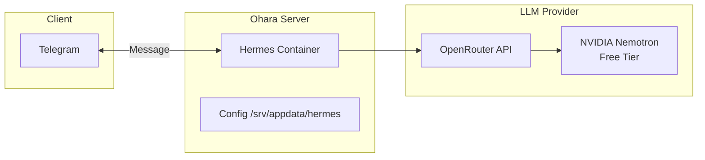
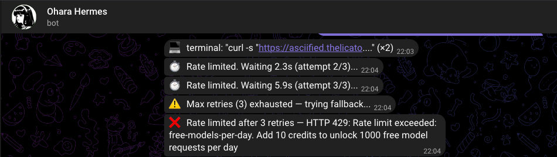
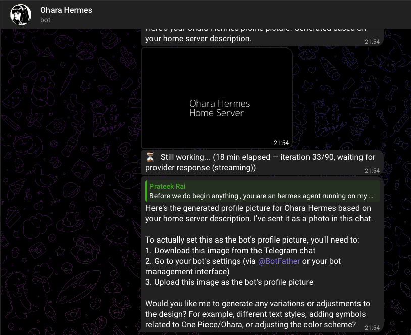
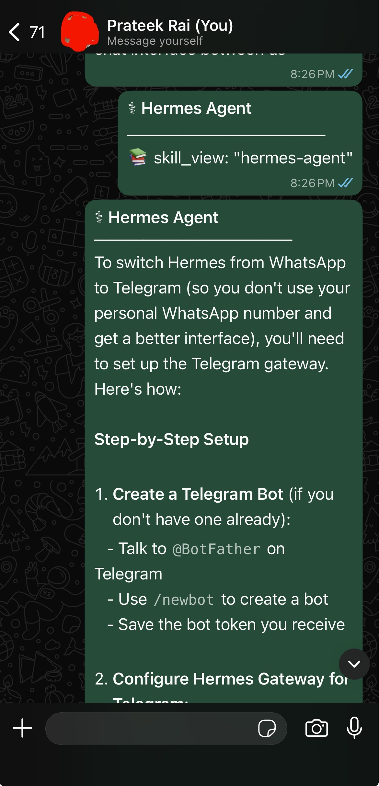
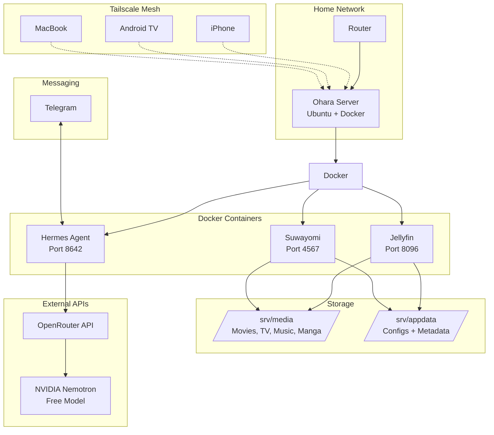

---
authors:
    - prateek11rai
categories:
  - Self-Hosting
  - AI
date: 2026-05-17
draft: false
---

# Ohara Learns to Talk: Self-Hosting an AI Agent with Hermes

Ohara had been running quietly under my desk for weeks. Jellyfin streamed movies. Suwayomi downloaded manga chapters overnight. The server did its job without complaint, invisible and silent.

But I wanted more. I wanted it to talk back.

{ loading=lazy }

<!-- more -->

The idea was simple: an always-on AI agent I could message from my phone, anywhere in the world, running on my own hardware. No subscriptions, no cloud lock-in, no monthly fees for toys I half-use. Just a Telegram bot that could think, remember, and eventually do things.[^1]

[^1]: Image attribution and credits — please [contact](mailto:prateek11rai@protonmail.com) if anything needs updating.

## Why Hermes

[Hermes Agent](https://hermes-agent.nousresearch.com) by Nous Research is an open-source AI agent framework designed to run on your own infrastructure. It connects to LLM providers (OpenRouter, OpenAI, Anthropic, local models) and messaging platforms (Telegram, WhatsApp, Discord) to become a persistent AI assistant.

What sold me:

| Requirement | Why Hermes |
|-------------|-----------|
| Runs on a Core 2 Duo | No local GPU needed — all inference is API-based |
| Self-hosted | My data, my config, my keys |
| Multi-platform | One agent, many messaging backends |
| Extensible | Skills, cron jobs, terminal access, memory |

The server's 15-year-old hardware does not matter here. Hermes does not run a model locally — it calls APIs. Ohara just needs to run a Docker container and have internet access. That is it.

## The Docker Setup

Hermes ships as an official Docker image, so it fits right into Ohara's existing infrastructure. I keep all app data under `/srv/appdata`, so Hermes lives at `/srv/appdata/hermes/`:

```
/srv/appdata/hermes/
├── docker-compose.yml
├── .env
└── data/
    ├── .env
    ├── config.yaml
    ├── platforms/
    ├── sessions/
    ├── memories/
    └── skills/
```

### docker-compose.yml

```yaml
services:
  hermes:
    image: nousresearch/hermes-agent:latest
    container_name: hermes
    restart: unless-stopped
    command: gateway run
    ports:
      - "8642:8642"
    volumes:
      - /srv/appdata/hermes/data:/opt/data
    environment:
      - OPENROUTER_API_KEY=${OPENROUTER_API_KEY}
```

The `.env` file beside the compose file holds just the OpenRouter key:

```
OPENROUTER_API_KEY=sk-or-...
```

Start it:

```bash
cd /srv/appdata/hermes
docker compose up -d
```

### The Permission Trap

On first boot, the `data/` directory gets created as root. Hermes then drops privileges to UID 10000 (the `hermes` user) inside the container and can no longer read its own files. You will know this happened because the container enters a restart loop with `PermissionError` in the logs.

The fix is simple — one-time, then it stays fixed:

```bash
sudo chown -R 1000:1000 /srv/appdata/hermes/data
docker compose down && docker compose up -d
```

This is the single most important thing to know about running Hermes in Docker. Every permission issue traces back to this. If you write files with `sudo tee` or `docker cp`, run that `chown` command afterwards.

## OpenRouter: Free LLM Access

Hermes needs an LLM to think. Running one locally on a Core 2 Duo with 4 GB RAM is not realistic. Instead, I route everything through [OpenRouter](https://openrouter.ai) — a single API key that gives access to 200+ models from every provider.

```bash
# Inside the container
docker exec -it hermes bash
source /opt/hermes/.venv/bin/activate
hermes model
```

This launches an interactive wizard. Two choices:
1. Select **OpenRouter** (the key is auto-picked from the `OPENROUTER_API_KEY` env var)
2. Pick a model

**The model I chose:** `nvidia/llama-3.1-nemotron-70b-instruct:free`

This is a NVIDIA-hosted Llama 3.1 variant available at no cost through OpenRouter's free tier.



The key insight: **the API route means your server's hardware does not matter.** A Raspberry Pi would work just as well. The server just needs to make HTTP requests and relay responses. No GPU, no RAM for model weights, no quantization — just a network connection.

## The Rate Limit Reality

Here is where the free tier fantasy meets reality. A brand-new OpenRouter key gets **50 free requests per day**. That sounds like a lot until you realize each Hermes conversation turn calls the model **3-5 times** — one for thinking, one for tool calls, one for the final response. Those 50 requests become 10-15 usable conversations before the key hits the wall.

You know you have hit the limit when Hermes stops responding and OpenRouter returns a `429` or a vague gateway error:

{ loading=lazy }

The fix is unsurprising:

> Add a minimum of **$10** in credits to your OpenRouter account. This unlocks **1000 requests/day** — more than enough for a personal bot.

$10 on OpenRouter lasts months for a single-user bot. The free tier is a generous trial — the paid tier is where it becomes actually useful. And $10 is still cheaper than a month of any subscription service.

## Telegram Integration

The messaging layer is what makes this useful. A web UI is fine for configuration, but the real power is messaging your server like a person.

### Step 1: Create the Bot

Open Telegram, search for [@BotFather](https://t.me/BotFather), and send `/newbot`:

1. Pick a name (I used `Ohara Hermes`)
2. Pick a username ending in `_bot` (e.g. `ohara_hermes_bot`)
3. BotFather replies with a token: `YOUR_BOT_TOKEN`

### Step 2: Get Your User ID

Telegram bots need to know who is allowed to talk to them. Find your numeric user ID by messaging [@userinfobot](https://t.me/userinfobot).

### Step 3: Configure Hermes

```bash
echo 'TELEGRAM_ENABLED=true' | sudo tee -a /srv/appdata/hermes/data/.env
echo "TELEGRAM_BOT_TOKEN=YOUR_BOT_TOKEN" | sudo tee -a /srv/appdata/hermes/data/.env
echo 'TELEGRAM_ALLOWED_USERS=8523398033' | sudo tee -a /srv/appdata/hermes/data/.env
sudo chown -R 1000:1000 /srv/appdata/hermes/data
docker restart hermes
```

!!! warning "Environment variable name"
    The correct variable is `TELEGRAM_ALLOWED_USERS`. Using `TELEGRAM_ALLOWED_USER_IDS` (which some older docs reference) will cause "Unauthorized user" errors in the logs and the bot will reject every message.

### Step 4: Test It

Open Telegram, find your bot by username, send a message. The agent responds. That is the whole setup — four commands and you have an AI assistant on your phone.

{ loading=lazy }

## The WhatsApp Detour

Hermes also supports WhatsApp through a Baileys-based bridge (emulates WhatsApp Web, no Business API needed). I tried it. I removed it.

The self-chat mode works in theory — you message yourself, Hermes replies in the same thread. In practice:
- The bridge rejected messages with `self_chat_mode_rejects_non_self` even though the sender was the paired number
- Permission conflicts between the bridge log (owned by root) and the gateway
- The user experience is worse than Telegram — no voice messages, limited formatting, and the self-chat thread gets confusing

Removal is clean:

```bash
# Inside container
sed -i '/^WHATSAPP/d' /opt/data/.env
rm -rf /opt/data/platforms/whatsapp
docker restart hermes
```

{ loading=lazy }

Telegram is the first-class messaging platform for Hermes. WhatsApp works but has rough edges I did not want to maintain.

## The Permission Pattern (It Keeps Happening)

Every Hermes issue I ran into traced back to the same root cause: **file ownership**. Here is the complete list of symptoms and the universal fix:

| Symptom | Cause |
|---------|-------|
| Container restart loop | `data/` owned by root, container UID 10000 can't write |
| `PermissionError: .bundled_manifest` | Skills file owned by root |
| `I have no name!` shell prompt | Cosmetic — UID 10000 not in /etc/passwd |
| Telegram unauthorized | Wrong env var name (`_USER_IDS` vs `_USERS`) |
| `.env` changes not picked up | File written with sudo, owned by root |

The fix every time:

```bash
sudo chown -R 1000:1000 /srv/appdata/hermes/data
docker restart hermes
```

## A DNS Detour: When Tailscale Broke GitHub Pages

This one was unexpected. After setting up Hermes, I tried to visit my GitHub Pages site (`https://prateek11rai.github.io/sanji/`) to check the previous blog post. The browser showed nothing. DNS lookup failed. But everything else on the internet worked fine.

The culprit was hiding in plain sight:

```bash
$ dig prateek11rai.github.io

;; SERVER: 100.100.100.100#53  # ← Tailscale DNS
;; status: SERVFAIL
```

Tailscale's MagicDNS was intercepting the `.github.io` lookup and failing to resolve it. The server at `100.100.100.100` — Tailscale's built-in DNS resolver — did not know how to handle GitHub Pages domains.

!!! note "The fix"
    **Temporarily disable Tailscale** — the site loads immediately through the normal DNS resolver. Alternatively, add a secondary DNS server (like `8.8.8.8`) in your system network settings while Tailscale is connected.

This is a quirk of how Tailscale handles DNS on macOS. It overrides your system DNS with its own resolver, and that resolver does not forward non-tailnet domains correctly in all configurations. The `.github.io` namespace is a GitHub-controlled TLD that Tailscale's DNS does not recognize.

## The Complete Architecture

Here is what Ohara looks like now:



## What Comes Next

Hermes has a built-in cron scheduler. I have started experimenting with daily prompts:

```bash
hermes cron add --schedule "0 6 * * *" --prompt "Check my Jellyfin library and recommend something to watch tonight" --platform telegram
```

The longer-term plan is a **coding agent** — Hermes that can clone a repo, run Claude Code through OpenRouter, make changes, commit, and create a PR, all triggered from a Telegram message. The infrastructure is ready: Hermes has terminal access, file system access, and network connectivity. It just needs the right skills configured.

But that is a post for another day.

## Things I Learned

1. **Permission issues are the #1 cause of Docker container crashes** — any file written as root inside a volume will eventually break something. `chown 1000:1000` after every file write and move on.
2. **API-based AI does not need a GPU** — a 15-year-old Core 2 Duo with 4 GB RAM is enough to run a full AI agent. The only requirement is internet access.
3. **OpenRouter free tier is a trial, not a plan** — 50 requests/day sounds fine until Hermes burns 3-5 per turn. Budget $10 to unlock 1000/day. It lasts months for a personal bot.
4. **Tailscale's DNS can interfere with non-tailnet domains** — `.github.io`, and potentially other TLDs, may fail to resolve through Tailscale's MagicDNS. Know how to bypass it.
5. **Telegram is the better platform** — WhatsApp integration exists but Telegram's bot API is cleaner, more reliable, and better documented. Start with Telegram.

{ loading=lazy }

The server under my desk still runs Jellyfin and Suwayomi. But now it also talks back. When I send a message to `@ohara_hermes_bot`, a container on that dusty old OptiPlex wakes up, calls a free NVIDIA-hosted model through OpenRouter, thinks about what I asked, and replies. No cloud subscription. No exposed ports. No GPU required.

That is the magic of self-hosting in 2026. The hardware you already own is enough.
