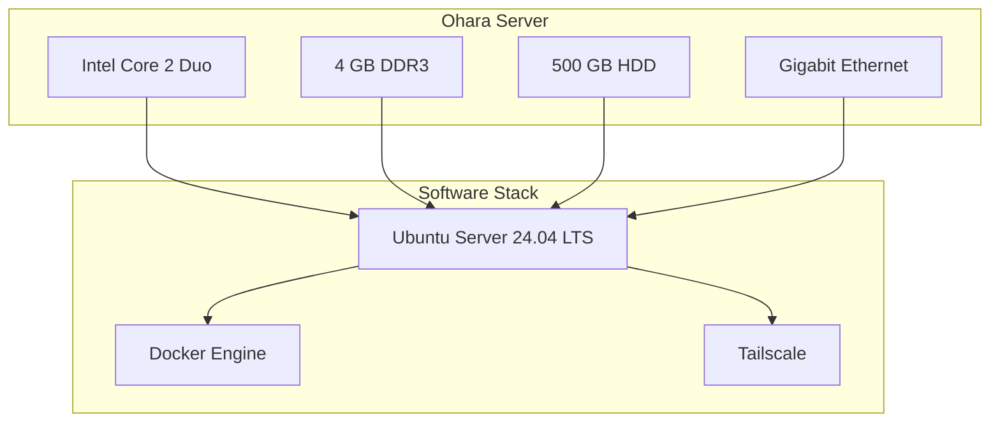
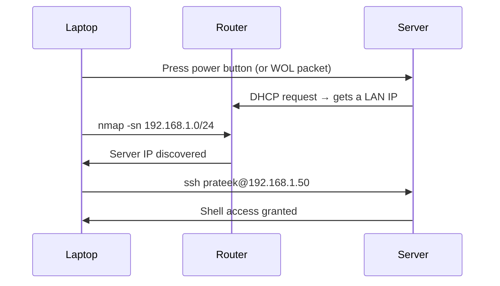
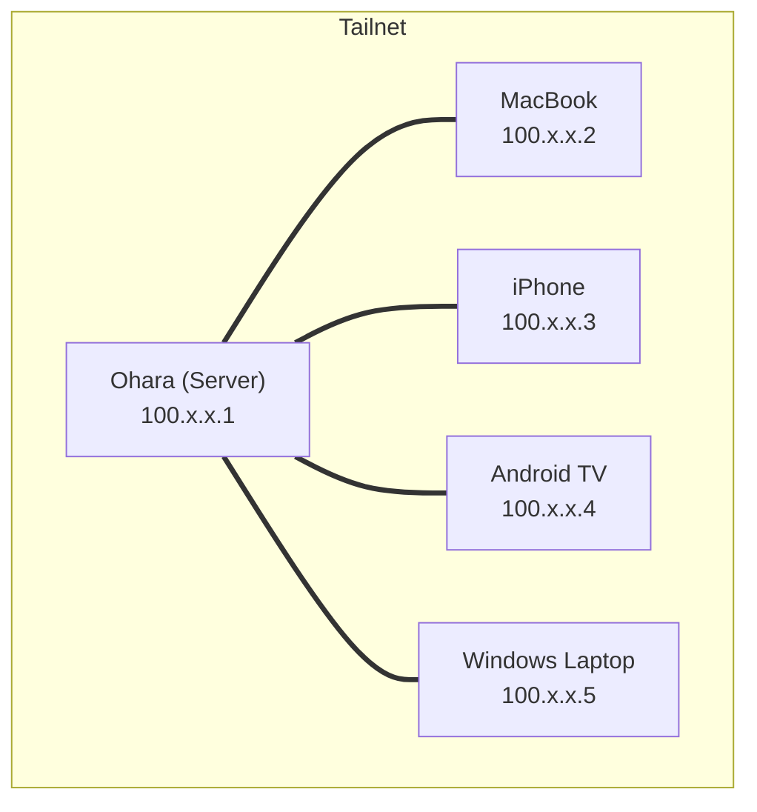
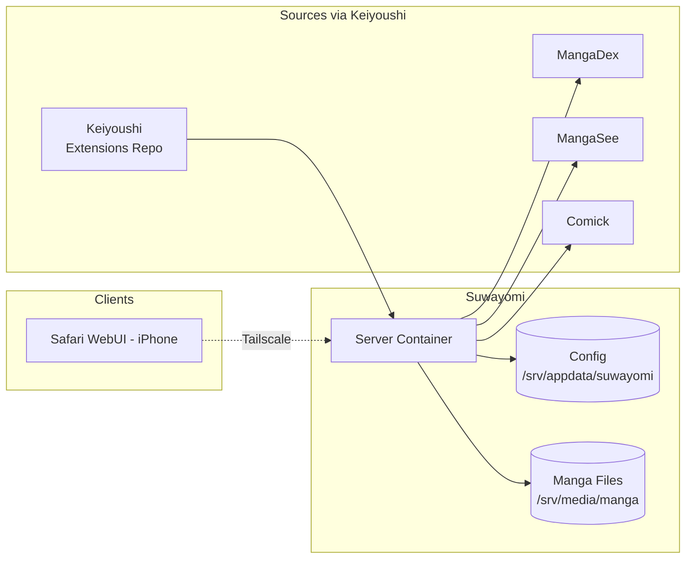
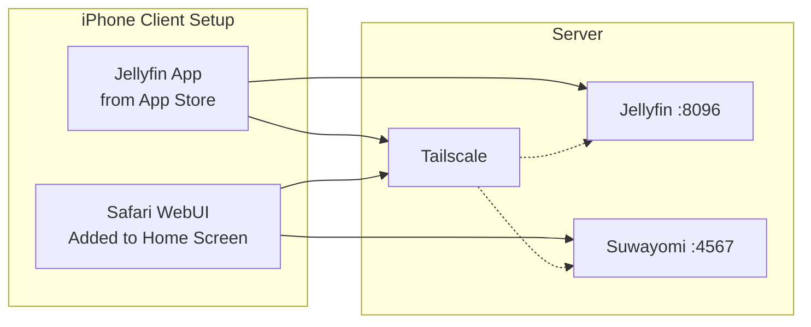
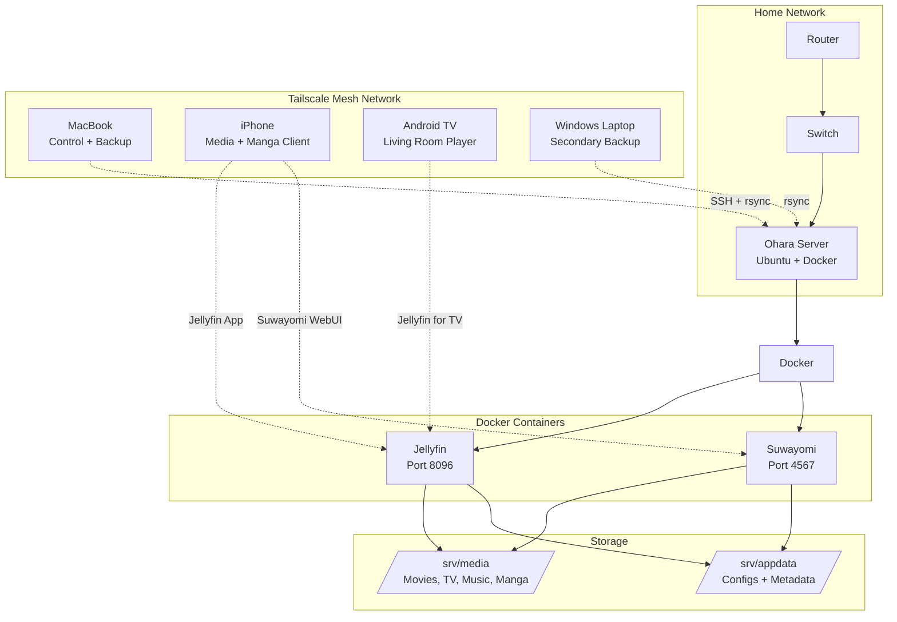

---
authors:
    - prateek11rai
categories:
  - Self-Hosting
  - Homelab
tags:
  - selfhosting
  - homelab
  - jellyfin
  - tailscale
date: 2026-05-10
draft: false
---
# Breathing Life Into an Old PC: Building a Self-Hosted Media & Manga Server

I had an old PC lying around — one of those machines you keep meaning to throw out but never do. It was slow, loud, and completely useless for modern computing. No one was going to browse the web on it, let alone run any real software.

Then it hit me: I could turn it into a server.

{ loading=lazy }

<!-- more -->

This is the story of how that dusty old tower became the backbone of my home media setup. I call it **Ohara** — after the island of scholars in *One Piece* — because it preserves and serves knowledge (and manga, and movies, and music) to every device in my house.[^1]

[^1]: If I have used any images that need attribution, please [contact](mailto:prateek11rai@protonmail.com) me.

## The Hardware: What I Was Working With

Before you go out and buy a Raspberry Pi or a NAS, look under your desk. Chances are you already own a server.

<style>
.grid.cards ul li:first-child .twemoji svg {
    fill: #eab308;
}
.grid.cards ul li:last-child .twemoji svg {
    fill: #22c55e;
}
</style>

<div class="grid cards" markdown>

-   :material-desktop-tower: **The Specs**
    - Old Dell OptiPlex office PC
    - Intel Core 2 Duo (~15 years old)
    - 4 GB DDR3 RAM
    - NVIDIA GeForce 8400 GS (2007-era, useless for AI)
    - 500 GB HDD + external USB drives
    - Gigabit Ethernet port
    - No monitor, no keyboard, no mouse

-   :material-checkbox-marked-circle: **What it can do**
    - Stream 1080p media to multiple devices ✔️
    - Self-host a manga server with auto-downloads ✔️
    - Run 24/7 on ~40W power ✔️
    - Serve files over a private encrypted network ✔️
    - Run LLMs or AI workloads ❌

</div>



The GPU is so old it predates CUDA entirely. But here is the thing: **media serving is not GPU-bound.** Jellyfin can hardware-transcode if you have a modern GPU, but for direct-play or software transcoding of 1080p content, even this Core 2 Duo handles it fine. The real bottleneck is always the network, not the CPU.

## The OS Choice: Ubuntu Server

I went with **Ubuntu Server 24.04 LTS** — minimal install, no desktop environment. The alternatives were:

- **Debian** — lighter, but hardware detection is worse and you lose out on broader community support
- **Alpine** — very light, but musl libc can cause Docker compatibility surprises
- **Proxmox** — overkill for a single machine, eats RAM for the hypervisor layer

Ubuntu Server wins because when something breaks, someone has already asked and answered the question on the internet.

### Installation Steps

1. Download the Ubuntu Server ISO via [torrent](https://ubuntu.com/download/server) — browser downloads are slow, magnets are faster
2. Create a bootable USB with [Rufus](https://rufus.ie) (Windows) or `dd` (Mac/Linux)
3. Boot the old PC from the USB, install Ubuntu Server — **do not install a GUI**, select "Install Ubuntu Server" and keep it minimal
4. During install, enable SSH and create your user account
5. After first boot:

```bash
sudo apt update && sudo apt upgrade -y
sudo apt install -y docker.io docker-compose-v2 ufw
sudo snap remove lxd  # remove unnecessary bloat
```

## Running It Headless

The PC sits under my desk with nothing plugged in except power and ethernet. No monitor, no keyboard. Everything is done over SSH.



```bash
# Find the server on your network
nmap -sn 192.168.1.0/24

# SSH in (use the IP you found)
ssh prateek@192.168.1.50
```

### Making Sure It Never Sleeps

Servers should run 24/7. The cleanest way to disable sleep on Ubuntu Server is through `logind`:

```bash
sudo mkdir -p /etc/systemd/logind.conf.d
sudo tee /etc/systemd/logind.conf.d/nosleep.conf << 'EOF'
[Login]
HandleSuspendKey=ignore
HandleHibernateKey=ignore
HandleLidSwitch=ignore
HandleLidSwitchExternalPower=ignore
IdleAction=ignore
EOF

sudo systemctl restart systemd-logind
```

## Storage Layout

All data lives under `/srv`, following the Linux Filesystem Hierarchy Standard:

```text
/srv/
├── media/
│   ├── movies/
│   ├── tv/
│   ├── music/
│   ├── music-videos/
│   └── manga/
└── appdata/
    ├── jellyfin/
    └── suwayomi/
```

The separation is deliberate: `/srv/media` holds the actual content (large, slow-changing), while `/srv/appdata` holds Docker configs and databases (small, needs backup). You can back up configs independently of media this way.

## Tailscale: The Networking Layer

I never expose any port to the public internet. Instead, everything is accessed through [Tailscale](https://tailscale.com) — a WireGuard-based mesh VPN that makes all my devices think they are on the same local network.



```bash
# On the server
curl -fsSL https://tailscale.com/install.sh | sh
sudo tailscale up
# Opens a URL — authenticate once, done forever

# On Mac
brew install tailscale && open /Applications/Tailscale.app

# On iPhone / Android TV
# Install from App Store / Play Store, log in
```

Once Tailscale is running, every device gets a `100.x.x.x` IP. I reach my server by its hostname from anywhere in the world — no DDNS, no port forwarding, no Cloudflare tunnels. It survives reboots automatically. If the server restarts, Tailscale reconnects without manual intervention.

### Verification Checklist

| Test | Command | Expected |
|------|---------|----------|
| Device visibility | `tailscale status` | All 4-5 devices listed |
| Network connectivity | `ping 100.x.x.x` | Replies from server |
| SSH over mesh | `ssh ohara` | Login prompt from anywhere |
| File transfer | `rsync -avz test.txt ohara:/tmp/` | File arrives |

## Docker Compose: The Infrastructure as Code

Every service runs in a container defined by a `docker-compose.yml`. The entire server can be rebuilt from these files in minutes.

### The Main Compose File

```yaml
# /srv/appdata/docker-compose.yml
services:
  jellyfin:
    image: jellyfin/jellyfin:latest
    container_name: jellyfin
    ports:
      - "8096:8096"
    volumes:
      - /srv/appdata/jellyfin:/config
      - /srv/media:/media:ro
    devices:
      - /dev/dri:/dev/dri  # hardware transcoding (if available)
    restart: unless-stopped
```

### Suwayomi: The Manga Server

[Suwayomi](https://github.com/Suwayomi/Suwayomi-Server) is a self-hosted manga reader server. It is a rewrite of **Tachiyomi** (the popular Android manga reader) for the server — it downloads chapters, stores them on disk, and serves them to clients over the web. The workflow is simple:

1. Browse and add manga from your phone via the WebUI
2. Suwayomi downloads the chapters to `/srv/media/manga/`
3. Read from any device — progress syncs automatically

The Docker Compose for Suwayomi lives alongside Jellyfin in my setup:

```yaml
# Suwayomi service — add to /srv/appdata/docker-compose.yml
services:
  suwayomi:
    image: ghcr.io/suwayomi/suwayomi-server:latest
    container_name: suwayomi
    ports:
      - "4567:4567"
    environment:
      - SUWAYOMI_USER=prateek
      - SUWAYOMI_PASSWORD=your_secure_password_here
    volumes:
      - /srv/appdata/suwayomi:/home/suwayomi/.local/share/Suwayomi
      - /srv/media/manga:/manga
    restart: unless-stopped
```

Start it:

```bash
cd /srv/appdata
docker compose up -d suwayomi

# Check it's running
docker compose ps

# Watch logs
docker compose logs -f suwayomi
```

#### Adding Manga Sources (Extensions)

Suwayomi is compatible with the **Tachiyomi/Mihon extension ecosystem**, but the way you add sources is different from the Android app. Extensions are added from *inside* the Suwayomi WebUI, not from the Docker config. This separation is intentional — infrastructure stays clean, and application config stays flexible.

Here is the important backstory. The original **Tachiyomi** project was discontinued. The community forked it into **Mihon** (the Android reader), and the extension ecosystem moved to **Keiyoushi** — a community-maintained repository of manga sources. Suwayomi can use this same repository.

I have both repos starred on GitHub:

| Repo | What it is |
|------|-----------|
| [`Suwayomi/Suwayomi-Server`](https://github.com/Suwayomi/Suwayomi-Server) | The server itself — a rewrite of Tachiyomi for desktop/server |
| [`keiyoushi/extensions`](https://github.com/keiyoushi/extensions) | Extension repository for Mihon and Suwayomi — sources like MangaDex, MangaSee, etc. |

To add sources to Suwayomi:

```bash
# Step 1: Open the WebUI
# In your browser (over Tailscale):
# http://ohara:4567
# or http://100.x.x.x:4567
```

1. Log in with the credentials you set in `docker-compose.yml`
2. Go to **Extensions** → **Repositories**
3. Add the Keiyoushi extensions repository URL:
   ```text
   https://keiyoushi.github.io/extensions/index.json
   ```
4. Click **Save** — the repository is now registered
5. Go to **Extensions** → **All**, refresh the list
6. You should now see sources like **MangaDex**, **MangaSee**, **Comick** available for install
7. Click **Install** on each source you want



Once installed, search for manga, add to your library, and enable **auto-download** for new chapters. The server becomes largely autonomous — new chapters are downloaded in the background, and your library updates on a schedule.

### Jellyfin: Movies, TV, and Music

Jellyfin is my unified media server. From the single docker-compose above, I get:

- **Movies & TV** — organized by metadata scrapers, streamed to any device
- **Music** — with album art, artist info, and gapless playback
- **Live TV** (optional) — if you plug in a tuner

The library structure maps directly to `/srv/media/`:

| Library Type | Path in Container | Path on Disk |
|---|---|---|
| Movies | `/media/movies` | `/srv/media/movies` |
| TV Shows | `/media/tv` | `/srv/media/tv` |
| Music | `/media/music` | `/srv/media/music` |

```bash
# Inside Jellyfin WebUI, add each library:
# Dashboard → Libraries → Add Media Library
# Type: Movies → Folder: /media/movies
# Type: TV Shows → Folder: /media/tv
# Type: Music → Folder: /media/music
```

Configure the "Prefer ARTISTS tag if available" setting under the Music library for correct artist metadata.

## How I Consume Everything Across Devices

The best part of this setup is that content follows me everywhere. Here is exactly how each device connects:

### iPhone



- **Jellyfin**: Install the Jellyfin Mobile app from the App Store, sign in with `http://ohara:8096` (the Tailscale MagicDNS hostname resolves over the mesh)
- **Manga (Suwayomi)**: Open Safari → `http://ohara:4567` → log in → tap the Share button → **Add to Home Screen**. It behaves like a native app: full-screen, dedicated icon, persistent session
- **Tailscale**: Always-on in the background. Without it, none of the above works outside my home WiFi

### Android TV

My TV runs Android TV, which does not come with Tailscale or Jellyfin pre-installed. You can sideload both via ADB:

```bash
# 1. Enable Developer Options on TV
# Settings → Device Preferences → About → Build → tap 7 times

# 2. Enable USB Debugging
# Settings → Developer Options → USB Debugging → ON

# 3. Find TV IP from network settings
# Example: 192.168.1.100

# 4. On your Mac/Laptop, connect and install
adb connect 192.168.1.100
adb install jellyfin-androidtv.apk
adb install tailscale.apk

# 5. On the TV, open Tailscale → log in
# 6. Open Jellyfin → sign in with http://ohara:8096
```

Once set up, the TV works outside home too — take it to a different city, connect to WiFi, Tailscale reconnects automatically and Jellyfin works.

### MacBook

The MacBook is my management machine. I use it for:

```bash
# SSH into the server from anywhere
ssh ohara

# Rsync backups
rsync -avz --progress ohara:/srv/media/manga/ ~/ohara-backup/manga/

# Edit compose files remotely
ssh ohara "vim /srv/appdata/docker-compose.yml"

# Rebuild containers after config changes
ssh ohara "cd /srv/appdata && docker compose up -d"
```

For media consumption, I use the Jellyfin WebUI in a browser. There are desktop clients (Jellyfin Media Player, Swiftfin) but the WebUI is good enough for occasional viewing.

### Windows Laptop

The Windows laptop serves as a secondary backup target. Over Tailscale:

```powershell
# Pull backup from server
rsync -avz prateek@ohara:/srv/media/manga/ D:\ohara-backup\manga\

# Push files to server
rsync -avz D:\documents\ prateek@ohara:/srv/media/documents\
```

No SMB shares, no mapped drives, no exposed ports — just SSH and rsync over the encrypted mesh.

## The Complete Architecture



## Backup Strategy

```bash
# From Mac — pull a full media backup
rsync -avz --progress ohara:/srv/media/ ~/ohara-backup/

# From Windows — mirror to external drive
rsync -avz prateek@ohara:/srv/media/manga/ D:\ohara-backup\manga\

# From server itself — backup to USB drive
rsync -avz /srv/appdata/ /mnt/usb-backup/appdata/
```

Three golden rules:
1. **Always use `--dry-run` first** — rsync is silent when it works and destructive when it doesn't
2. **Trailing slashes matter** — `ohara:/srv/media/` copies contents, `ohara:/srv/media` copies the folder itself
3. **No SMB needed** — SSH + rsync is cleaner, scriptable, and works over Tailscale from anywhere

## What Running This Feels Like Day to Day

The server is invisible. It sits under my desk, silent, doing its job. Here is what a typical day looks like:

1. **Morning**: New manga chapters were downloaded overnight (Suwayomi auto-updates at 3 AM)
2. **Afternoon**: I start a movie on the TV via Jellyfin, pause it, continue on my phone in another room
3. **Evening**: I discover a new manga on my phone, add it to my library via Suwayomi WebUI
4. **Night**: An automated rsync cron job backs up appdata to an external drive

The only time I SSH into the server is when I add a new service or update a container. Everything else runs itself.

## Why "Ohara"?

In *One Piece*, Ohara was the island of scholars — a place where knowledge was pursued, preserved, and archived. The World Government destroyed it for holding too much knowledge, but the legacy survived through the survivors who carried books in their memory.

{ loading=lazy }

A home server is a much smaller act of preservation. But it is the same impulse: keep your own things on your own hardware, under your own control. Your media library, your manga collection, your files — they should outlive any streaming service's licensing decisions or any cloud provider's terms of service changes.

You do not need a data hoarding disorder to want that. You just need an old PC, a weekend, and the willingness to `ssh` into a box that lives under your desk.

## What You Will Have at the End

:material-check-circle: A 24/7 headless server that needs no monitor, keyboard, or mouse  
:material-check-circle: Remote access from anywhere via Tailscale — no ports open to the internet  
:material-check-circle: A full media server (Jellyfin) for movies, TV, and music  
:material-check-circle: A self-hosted manga server (Suwayomi) with auto-downloads and cross-device sync  
:material-check-circle: Clients working on iPhone, Android TV, Mac, and Windows  
:material-check-circle: An automated backup pipeline over SSH  
:material-check-circle: Infrastructure-as-code with Docker Compose — rebuild the entire server from a single YAML file

The barrier to entry for homelabbing has never been lower. Ubuntu Server is free. Docker Compose turns deployment into a single YAML file. Tailscale makes networking trivially secure. All you need is the hardware you already have lying around, gathering dust.

Go build your Ohara.
