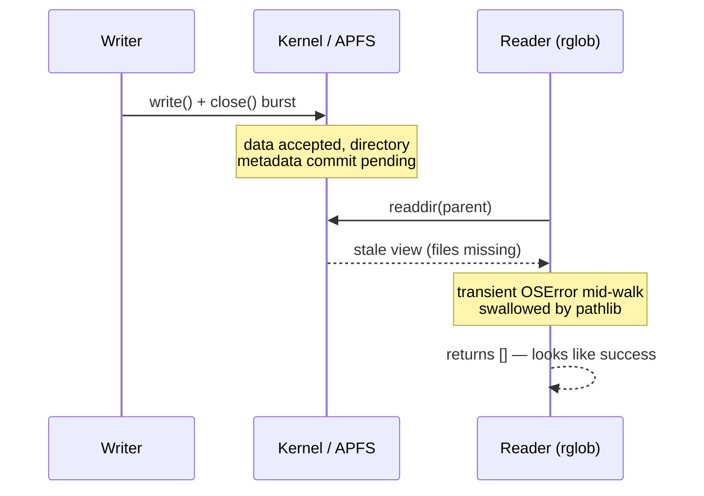

---
authors:
    - prateek11rai
categories:
  - Python
  - Debugging
tags:
  - python
  - macos
  - debugging
  - filesystem
date: 2026-07-04
draft: false
---

# How Python's rglob Silently Loses Files, and Why macOS Makes It Worse

A Python service I work on did something that shouldn't be possible. It wrote a directory full of files, turned around to upload them, and found nothing. The files were right there — `ls` saw them from another terminal.

The upload logged success. Zero files. No exception. Digging into why took me through three separate layers of the stack, each one lying just a little, and a paper trail going back to 2015 that almost nobody has read.

{ loading=lazy }

<!-- more -->

The record of every one of these problems has been sitting in public bug trackers and mailing lists for years — some of it for two decades. This post is the story of the bug, the archaeology of who reported what and when, and the fix we shipped while the deeper layers stay unfixed.[^1]

If this corner of the stack is new to you, here's the short version of each layer, in the order the post walks them:

1. **Python's `rglob` hides errors.** It walks a folder tree and returns every file it finds — and if the operating system refuses or fails anywhere along the walk, it silently skips instead of complaining. A folder it couldn't read looks exactly like a folder with nothing in it.
2. **The operating system never promised your listing was fresh.** A listing that runs while files are still being written is allowed to miss the newest ones — on every system — and macOS widens that window in ways Apple has never documented.
3. **The standard repair tool is weaker on Macs.** `fsync`, the call that's supposed to force pending writes all the way down to disk, only goes halfway on macOS. The real version is a separate, slower call that most software never makes.

Each section below expands one layer, with receipts. When the jargon gets thick, look for the collapsible "in plain English" boxes — they're there so you can keep up without leaving the page.

## A Program That Succeeds at Doing Nothing

The service writes a batch of parquet files (the columnar data files pipelines pass around) into a directory, then hands that directory to an uploader. The uploader does what every Python tutorial would tell you to do:

```python
discovered = [p for p in src.rglob("*") if p.is_file()]
results = [upload(p) for p in discovered]
reason = "uploaded" if discovered else "skipped:nothing_to_upload"
```

`pathlib` is the modern, blessed way to walk a directory. On a quiet machine this always works. In production — Linux containers on ARM, like almost everyone's production — it intermittently returned an empty iterator for a directory that had files in it. An `os.listdir` in the same process, microseconds later, saw them fine.

The insidious part is what happens next: nothing. The caller sees an empty list and proceeds. Logs say the upload completed. The next pipeline stage treats the empty result as a legitimate zero-row dataset. A program that crashes gets fixed the same day; a program that silently does nothing can lie to you for months.

So I did the obvious thing and tried to reproduce it locally — on an Apple Silicon MacBook, because that's what dev laptops are now. It reproduced. Then it kept reproducing in ways production had never shown: wider windows, weirder timings, listings that disagreed with each other from one call to the next. The repro environment was lying in more ways than the production one.

It turned out three independently-true facts were involved. The first fires on every platform and is the heart of the production bug. The second is allowed everywhere but gets dramatically worse on a Mac. The third is purely a macOS problem — and it matters because a Mac is where you'll be standing when you try to debug this. None of the three is a bug in the villain sense. All of them are documented — if you know where to dig.

## Layer One — pathlib Swallows Errors, and Has Since 2015

`rglob` works by walking into a folder, asking the operating system what's inside, and repeating that for every subfolder it finds. At any step of that walk, the OS can say no: you don't have permission, the thing it was reading vanished a moment ago, a read transiently failed. In Python, those refusals arrive as an `OSError` exception.

Here's the design decision at the heart of this post: when that happens inside `glob()` or `rglob()`, pathlib catches the error and just keeps going. No exception, no warning, no hook to find out it happened. Whatever it was scanning at that moment quietly drops out of the results. So the output of `rglob` cannot distinguish "this directory is empty" from "this directory has a thousand files I wasn't allowed to see."

??? info "In plain English — what 'swallowing an error' looks like"
    Deep inside pathlib's directory walk sits the moral equivalent of this:

    ```python
    try:
        entries = os.scandir(directory)   # ask the OS what's inside
    except OSError:
        pass                              # couldn't read it? pretend it was empty
    ```

    `try/except` is Python's error handling: *try* the risky thing, and if it fails, run the *except* block instead of crashing. An `except` block containing only `pass` means "do nothing, tell no one." It's occasionally the right tool — and it is exactly the wrong default for a function whose entire job is telling you what exists.

The paper trail on this is remarkable, and nobody has ever written it up as a story. It starts in May 2015, when a bug tracker user named Gregorio filed [cpython#68308](https://github.com/python/cpython/issues/68308) — asking, reasonably, that `rglob` *stop crashing* on unreadable directories and skip them the way `os.walk` does. Core developer Serhiy Storchaka was the lone dissent, proposing a bash-`failglob`-style option to surface errors instead. That idea was deflected to "a different issue" which was never filed.

The suppression patch, written by Ulrich Petri, then stalled for six months — its reviewer, pathlib author Antoine Pitrou, had stepped away from core development. It got unstuck in January 2016 because Guido van Rossum personally hit the bug: "I'm just going to commit this." Two days later he noticed his own fix made results depend on directory scan order — "dependent on the ordering of the names returned by listdir(), which is just wrong" — re-patched it, and closed with a line that reads differently a decade later: "Should be fixed for real now."

It wasn't. In 2019, Thierry Parmentelat filed [cpython#83075](https://github.com/python/cpython/issues/83075) with `strace` output showing that a single symlink into an unreadable directory made `glob()` silently drop *other, perfectly readable* files. Matt Wozniski reduced it to a five-command repro, and Pablo Galindo root-caused it as a regression from a performance rewrite. Nobody had noticed — because the failure mode is silence, exactly as Guido's warning predicted.

The endgame is the telling part. In 2021, [cpython#90208](https://github.com/python/cpython/issues/90208) asked for an opt-in flag to surface the errors. It was resolved in 2023 by pathlib's maintainer Barney Gale going the *other* way: suppressing **all** `OSError` below the top-level path. That shipped in Python 3.13, whose docs now state that errors are "suppressed in many cases, but not all." And in March 2026, Jakub Kuczys demonstrated that `list(Path('/root').glob('*'))` returns `[]` with zero indication anything went wrong — and filed [cpython#146646](https://github.com/python/cpython/issues/146646) as a *docs-only* issue, writing: "Based on #68308 (and just the fact that it has stayed unchanged for years), I assume this is intentional." Eleven years in, the behaviour's age had become the argument for keeping it.

What makes this sting is that CPython knows how to do better — it just didn't do it here. `os.walk` has taken an `onerror` callback since forever. `Path.walk`, added in 3.12, takes `on_error`. POSIX `find` prints to stderr and exits nonzero when it can't read a directory. `glob` and `rglob` give you nothing. "Errors should never pass silently. Unless explicitly silenced" is in the Zen of Python; there is no way to explicitly un-silence these.

The most rigorous Python codebases already know. Black recurses with `iterdir` and handles errors itself. pytest's internal `visit()` helper walks with `os.scandir`. mypy's file cache catches `OSError` and *re-raises* it. Ruff walks the tree in Rust.

!!! tip "Trivia"
    Ruff has a lint rule, [PTH207](https://docs.astral.sh/ruff/rules/glob/), that tells you to replace `glob.glob` with `Path.glob` because pathlib is more idiomatic. The migration it recommends moves you from an API that suppresses *most* errors to one that, since 3.13, suppresses *all* of them below the root. The linter whose own authors bypass pathlib for traversal nudges everyone else toward it.

!!! quote "Hot Take"
    Documenting a footgun is not fixing a footgun. The 3.13 docs note and the 2026 glob-module note upgraded a decade-old surprise from "undocumented behaviour" to "intended behaviour" without adding a single way to opt out. That's the cheapest possible resolution each time, and it's now load-bearing: any future fix would be a documented-behaviour break.

Switching to `os.scandir` — the lower-level directory-scanning call that pathlib itself is built on — closes this class entirely. Errors propagate, and as a bonus it's roughly twice as fast, because it hands back entries that already carry their file-type information instead of asking the OS again for each one. But it doesn't explain why the *operating system* handed Python a stale view in the first place. That's the next layer down.

## Layer Two — The Filesystem Never Promised You a Fresh Listing

Here's the part I would have called a kernel bug, before I read the spec. Whenever any program lists a folder — `ls`, Finder, Python's `os.listdir`, pathlib's walk — it ultimately goes through one low-level operation: `readdir`, the operating system's "tell me what's in this directory" call. POSIX, the standard that defines how that call must behave on Unix-like systems, says something remarkable in the [readdir specification](https://pubs.opengroup.org/onlinepubs/009695399/functions/readdir_r.html): "If a file is removed from or added to the directory after the most recent call to opendir() or rewinddir(), whether a subsequent call to readdir() returns an entry for that file is unspecified."

Unspecified. A listing that races a write is allowed to miss files, *by design*, on every POSIX system. That clause, plus layer one silently eating whatever inconsistency it produces, is already enough to explain the production incidents on Linux. What it doesn't explain is why the local repro on my Mac was so much *worse* — and that's an APFS question. APFS is the copy-on-write filesystem on every modern Mac, and the honest answer to what it does to directory listings under pressure is that nobody outside Apple knows.

??? info "In plain English — a new file is two writes, not one"
    Creating a file changes two separate things: the file's contents (the bytes you wrote) and the folder's own records saying "a file with this name now exists here" — the *metadata*. They are not committed at the same instant. APFS batches its metadata updates for speed using a copy-on-write structure: it builds a new version of the folder's records off to the side and atomically swaps a pointer when it commits. Until that swap happens, both of these can be true at once: the file's bytes are fully written and you can `open()` it by name, *and* a directory listing still reads the old records and doesn't show it. "The file exists" and "the folder doesn't list it" are not contradictions — they're two different questions asked of two different data structures.

I want to be careful here, because this is the least-documented layer of the three. Apple's [APFS Reference](https://developer.apple.com/support/downloads/Apple-File-System-Reference.pdf) describes the copy-on-write B-tree design across 181 pages and does not mention `readdir` once. There is no published contract for when a freshly created file becomes visible to directory enumeration. What I saw while reproducing locally — files that `stat` (the "does this exact path exist?" check) and `open` could see by name while a concurrent recursive listing came back without them, under burst writes on an Apple Silicon laptop — is consistent with metadata commits lagging data writes, but I can't point you at an Apple document that says so, because there is no Apple document that says anything about it at all. The silence is the finding.

What *is* on the record is enough to stop giving APFS the benefit of the doubt. In 2020, Giovanni Pizzi of the AiiDA project filed [bpo-41291](https://bugs.python.org/issue41291) after tests caught freshly written files reading back empty with `st_ino == 0`. CPython's macOS maintainer Ronald Oussoren reproduced it in pure C and bisected it by filesystem: the race fires on APFS, and not on HFS+. His conclusion: "This appears to be a bug in the APFS filesystem implementation." It was reported to Apple as FB8009608. There is no public resolution.

Two years earlier, Gregory Szorc had [profiled Firefox builds on macOS](https://gregoryszorc.com/blog/2018/10/29/global-kernel-locks-in-apfs/) and found `readdir` on APFS serializing on a global kernel lock — the machine spending ~75% of its CPU time in the kernel just listing directories. Different symptom, same neglected code path, same ending: a radar filed, a partial improvement shipped without comment, no acknowledgement.

One precision note, because it matters for anyone debugging their own version of this: several distinct mechanisms produce the "listing lies" symptom, and they are not the same bug. A writer in another process racing your listing is POSIX-unspecified territory. Files changing while you're mid-walk is a TOCTOU problem — time-of-check to time-of-use, meaning the world changed between when you looked and when you acted. `bpo-41291` is an apparent APFS defect. iCloud and Dropbox "dataless" files break globbing in their own special way. And a file you wrote but never flushed is a *you* problem. The fix depends on which one you have. Production, on Linux, appeared to be the first one amplified by pathlib's silence; the local Mac repro stacked, on the evidence of bpo-41291, some genuine APFS strangeness on top.

So the instinctive fix is: force the pending metadata down before listing. Sync the directory. Which brings us to the third layer, because on a Mac, that doesn't do what you think either.

## Layer Three — fsync Is a Polite Request on macOS

On Linux, `fsync(fd)` means: this data is on durable storage before the call returns. On macOS, `fsync(fd)` means: this data has been handed to the drive, which may keep it in a volatile cache and write it whenever it feels like it. Apple's own [fsync man page](https://developer.apple.com/library/archive/documentation/System/Conceptual/ManPages_iPhoneOS/man2/fsync.2.html) has said so for over twenty years, and it's blunt about the consequences: "This is not a theoretical edge case."

??? info "In plain English — the three stops between your program and the disk"
    When you write a file, the bytes make three stops: your operating system's memory (fast, lost if the OS crashes), the drive's own internal cache (fast, lost if power cuts out), and finally the durable flash storage (survives anything short of hardware failure). `fsync` is the call that's supposed to mean "push my data all the way down, then tell me." On Linux it pushes through all three stops. On macOS it stops at the drive's cache — so data that `fsync` just claimed was safe can still be eaten by a power cut. The macOS call that pushes all the way is `fcntl(fd, F_FULLFSYNC)`, and it's dramatically slower — which is exactly why it isn't the default, and exactly why almost nothing uses it.

The picture is worth having in your head — three stops, and the two systems disagree about which stop "safe" means:


`fsync` on Linux pushes your data to stop 3. `fsync` on macOS stops at 2 and reports success anyway. The real flush is a separate call, `fcntl(fd, F_FULLFSYNC)`, which pushes to stop 3 and has existed since Mac OS X 10.3 in 2003. The canonical explanation came from Apple filesystem engineer Dominic Giampaolo on the [PostgreSQL mailing list in 2005](https://postgrespro.com/list/thread-id/1658794) — he'd verified drive-cache behaviour with a logic analyzer on the ATA cable, and described the full flush as "a heavy handed operation... But in an app like a database, it is essential." The database world quietly listened: SQLite added `PRAGMA fullfsync` in 2004, PostgreSQL grew `fsync_writethrough`. Everyone who truly needed durability opted in twenty years ago, which is precisely why there was never enough pressure to change the default.

The rest of us found out in February 2022, when Asahi Linux's Hector Martin measured an M1's SSD doing [~46 IOPS with real flushes versus ~40,000 without](https://mjtsai.com/blog/2022/02/17/apple-ssd-benchmarks-and-f_fullsync/) and called it benchmark cheating. Michael Tsai's roundup of the ensuing fight is the fairest record — including the counter-voices: most non-Apple consumer drives simply lie about flushes, and when Russ Bishop power-loss-tested four NVMe SSDs, half of them lost data they had claimed to flush. Alex Miller's ["Darwin's Deceptive Durability"](https://transactional.blog/blog/2022-darwins-deceptive-durability) distilled it for database people into three deadpan headings: fsync does not fsync, O_DSYNC does not O_DSYNC, SQLite is not durable.

If this shape feels familiar, it's because the same thing happened to Linux, differently. In 2018, PostgreSQL's Craig Ringer discovered that when Linux `fsync` *fails*, the kernel drops the dirty pages and the next `fsync` returns success — the data is gone but nothing will ever tell you again. His report is a small masterpiece of dry understatement: "The write never made it to disk, but we completed the checkpoint, and merrily carried on our way. Whoops, data loss." The community called it fsyncgate; [Jonathan Corbet's LWN writeup](https://lwn.net/Articles/752063/) and [Dan Luu's verbatim archive](https://danluu.com/fsyncgate/) are the definitive accounts. PostgreSQL's eventual fix was to stop trusting the syscall entirely and PANIC on the first failure. Two years later, a [USENIX study](https://research.cs.wisc.edu/adsl/Publications/cuttlefs-tos21.pdf) checked whether *any* major application handles fsync failure correctly. None do.

For our bug, the punchline is narrower: the tool you'd reach for to close layer two — sync the parent directory, then list — is itself weaker than its name on the exact platform where layer two bites. To actually barrier the metadata on a Mac, you need `F_FULLFSYNC` on the directory file descriptor, at a cost of 5–20ms on NVMe.

## How Three Half-Truths Compound

Any one of these alone is trivia. Stacked, they turn the friendliest file API in Python into silent data loss. Read the diagram top to bottom — this is the order it happens in at runtime:



| Layer | What it's supposed to guarantee | What it actually guarantees on a Mac |
|---|---|---|
| `Path.rglob` | Returns every file in the tree | Returns whatever `readdir` delivered, silently dropping anything that errored |
| `readdir` on APFS | The current contents of the directory | Whatever the current B-tree state says; freshness under concurrent writes is unspecified |
| `fsync(dir_fd)` | Pending metadata committed to durable storage | Committed to the kernel's buffers; the drive cache needs `F_FULLFSYNC` |

In production on Linux, the stack is two layers deep — the POSIX-unspecified readdir window and pathlib's silence on top of it. On a Mac dev box it's all three, which is why the bug was easier to reproduce at my desk than it ever was to catch in the logs. The window is tens of milliseconds. The probability per call is tiny. The probability across a multi-hour pipeline run writing thousands of files is not — and every miss looks exactly like a legitimately empty directory.

The reframe that finally made the fix obvious: a directory listing is not a query. It's a measurement. It has noise, it has a sampling window, and if you need it to be right, you have to engineer for that the way you would for any other measurement.

## What We Shipped

Four moves, layered so that each one covers the residual risk of the previous:

1. **Replace `rglob` with an `os.scandir` recursion** that re-raises `OSError` as a typed error. Silent suppression becomes a loud failure.
2. **Barrier the directory metadata before listing** — `F_FULLFSYNC` on Darwin, `os.fsync` elsewhere.
3. **Reconcile two independent listings** and retry briefly if they disagree.
4. **Log a structured warning** if reconciliation never converges, so operators hear about the cases we can't fix.

```python
F_FULLFSYNC = 51  # macOS-only fcntl command

def _flush_directory_metadata(path: Path) -> None:
    """Force pending directory mutations to commit before we list."""
    fd = os.open(path, os.O_DIRECTORY)
    try:
        if sys.platform == "darwin":
            try:
                fcntl.fcntl(fd, F_FULLFSYNC)
            except OSError:
                os.fsync(fd)  # APFS-on-a-not-real-disk fallback
        else:
            os.fsync(fd)
    finally:
        os.close(fd)

def _scandir_recursive(path: Path) -> list[Path]:
    """Like Path.rglob, but surfaces OSError instead of dropping entries."""
    out: list[Path] = []
    try:
        with os.scandir(path) as it:
            for entry in it:
                if entry.is_dir(follow_symlinks=False):
                    out.extend(_scandir_recursive(Path(entry.path)))
                elif entry.is_file(follow_symlinks=False):
                    out.append(Path(entry.path))
    except (PermissionError, FileNotFoundError) as exc:
        raise StorageListingError(path=str(path)) from exc
    return out

def safe_list_directory(path: Path, max_attempts: int = 3) -> list[Path]:
    """Race-safe recursive listing for freshly written directories."""
    _flush_directory_metadata(path)
    backoffs = (0, 0.05, 0.10, 0.20)
    last: list[Path] = []
    for attempt in range(max_attempts):
        if backoffs[attempt]:
            time.sleep(backoffs[attempt])
        scandir_files = _scandir_recursive(path)
        listdir_set = set(os.listdir(path))
        scandir_top = {p.name for p in path.iterdir()}
        if listdir_set == scandir_top:
            return scandir_files
        last = scandir_files
    logger.warning(
        "directory_listing_never_converged",
        path=str(path),
        attempts=max_attempts,
    )
    return last
```

About 60 lines — bring your own exception type and logger — and it drops in at every `rglob` call site with no API change for callers. Copy it if you have the same problem.

The Darwin branch exists because dev machines and local test runs live on Macs even though production doesn't; the same code takes the plain `os.fsync` path on the Linux boxes that actually serve traffic. The cost on a Mac is dominated by `F_FULLFSYNC`: 5–20ms per listing on NVMe. On Linux it's far cheaper. For a pipeline that lists a handful of times per run and then spends minutes uploading, that's a trade we'll make every day. And I'll be honest about what it is: probabilistic, not deterministic. A long enough metadata stall would outlast the retry loop. The warning log is the admission that we've tightened the window, not closed it.

## The Fixes That Don't Trust Listings

Closing the window for real means restructuring so the race can't exist, and every mature system that has faced this converged on one of three shapes — none of which trust a directory listing:

- **Sentinel markers.** The writer touches a marker file last, after everything is flushed; readers refuse to list until the marker exists. Hadoop's `_SUCCESS` file, carried forward by Spark, Hive, and Iceberg.
- **Atomic rename.** Write into a staging directory, flush, then `rename` it into place — POSIX guarantees observers see the old state or the new state, never a partial one. Maildir has done this since 1995; Git's `index.lock` is the same idea.
- **Kernel events instead of listings.** Subscribe to FSEvents/inotify before writing and build the file set from events. Watchman, Buck2, and Mercurial's fsmonitor live here.

There's an optimistic precedent for the "or the platform just fixes it" ending, too. S3's LIST calls were eventually consistent for fourteen years, and it bit production hard enough that Netflix built [s3mper](https://netflixtechblog.com/s3mper-consistency-in-the-cloud-b6a1076aa4f8) — Daniel Weeks's 2014 writeup could be this post's abstract: "there is no indication that a problem occurred... if only a small portion of input is missing the results will appear convincing." Hadoop built S3Guard for the same reason. Then in December 2020, [AWS made S3 strongly consistent](https://aws.amazon.com/blogs/aws/amazon-s3-update-strong-read-after-write-consistency/) for everyone, retroactively, for free — Werner Vogels's [engineering post-mortem](https://www.allthingsdistributed.com/2021/04/s3-strong-consistency.html) notes the formal verification took more work than the implementation. The S3Guard docs now just say: delete the DynamoDB table.

Sit with the irony for a second: an object store on the other side of the planet now gives you stronger listing guarantees than the filesystem on the laptop you're reading this on.

## The People Who Dug First

Almost nothing in this post is my discovery. The record was public the whole time — it just took a production incident to make me read it. Credit where it belongs:

- **The pathlib thread**: Gregorio (the 2015 report), Serhiy Storchaka (the road not taken), Guido van Rossum (the warning that came true), Thierry Parmentelat and Matt Wozniski (the strace proof), Pablo Galindo (the regression fix), Barney Gale (3.13's resolution), and Jakub Kuczys (the 2026 issue that finally got it documented).
- **The Darwin durability thread**: Dominic Giampaolo (the 2005 explanation that still holds), Hector Martin (the numbers), Michael Tsai (the fairest record of the fight), Alex Miller (the essay to read first), and Howard Oakley (the calm explainer).
- **The fsyncgate thread**: Craig Ringer (the discovery), Jonathan Corbet (the no-villains account), Dan Luu (the archive, and the whole "files are hard" genre), Thomas Munro and Andres Freund (the fix), and Ted Ts'o (the kernel's side of the story, which deserves to be heard).
- **The APFS thread**: Giovanni Pizzi and Ronald Oussoren (the one acknowledged race, bpo-41291), and Gregory Szorc (the readdir profiling). This thread is the shortest because almost nobody has dug here. That should probably change.

If you take one action from this post, make it structural: treat directory listings as measurements, surface your errors, and when correctness matters, publish atomically or use a marker. The standard library teaches you to trust the listing. Production says don't.

---

The scholars of Ohara, with the Buster Call bearing down on them, threw their books into the lake so the knowledge would outlive the island. Twenty years later it was all still there, waiting for someone willing to dive.

The knowledge about this bug was never hidden either. It's been sitting in open issue trackers, mailing list archives, and man pages since before some of the people hitting it learned Python — eleven years of it in one CPython thread alone. Nobody burned the library. We just stopped reading the poneglyphs.

{ loading=lazy }

[^1]: Intro and closing images are from the One Piece anime via the [One Piece Wiki](https://onepiece.fandom.com/). Attribution and credits — please [contact](mailto:prateek11rai@protonmail.com) if anything needs updating.
