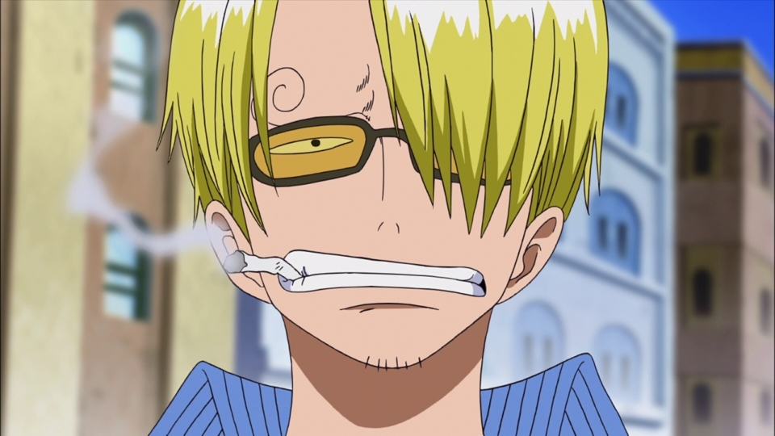
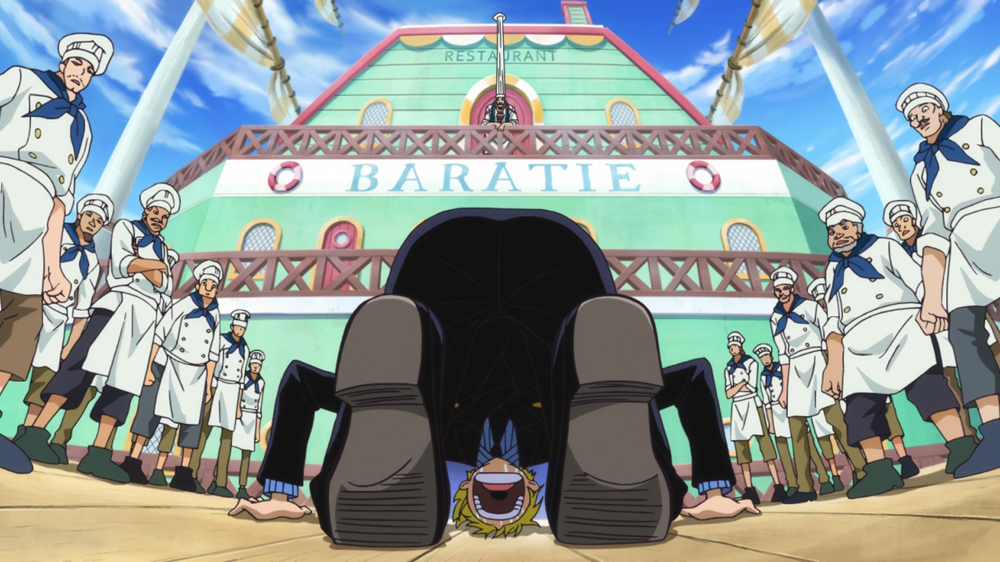
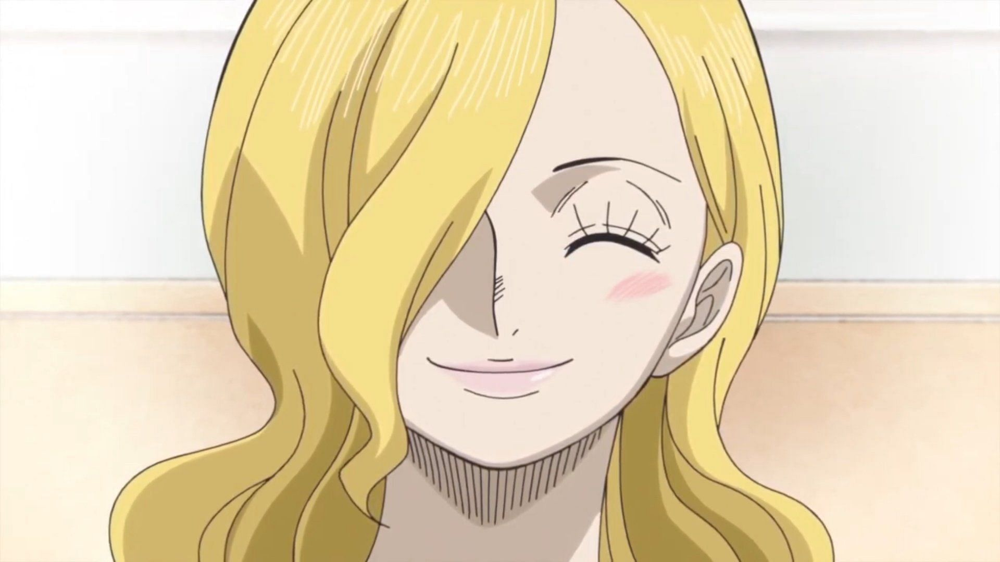
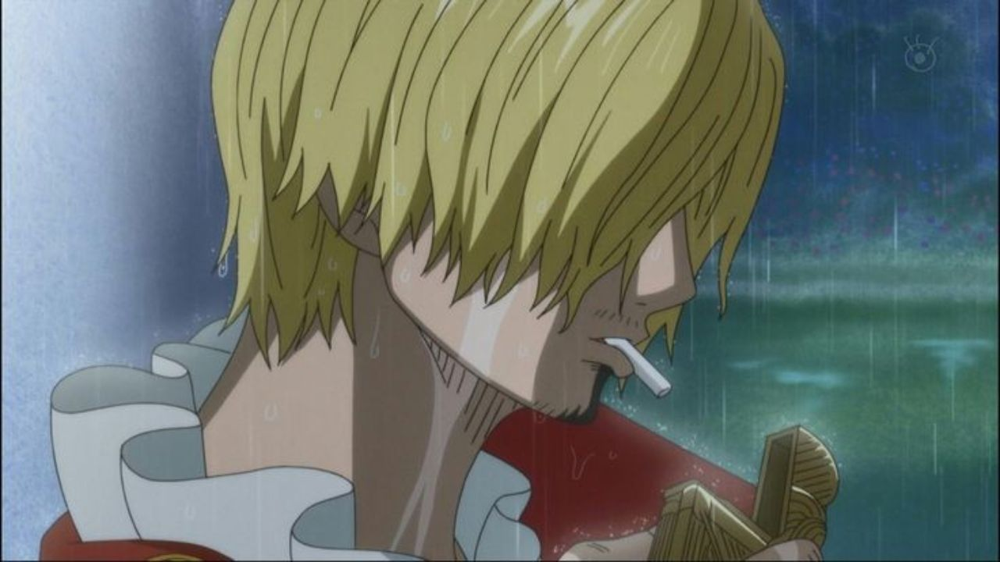
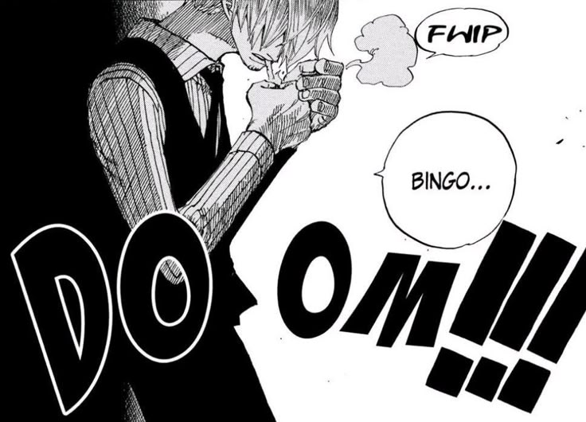
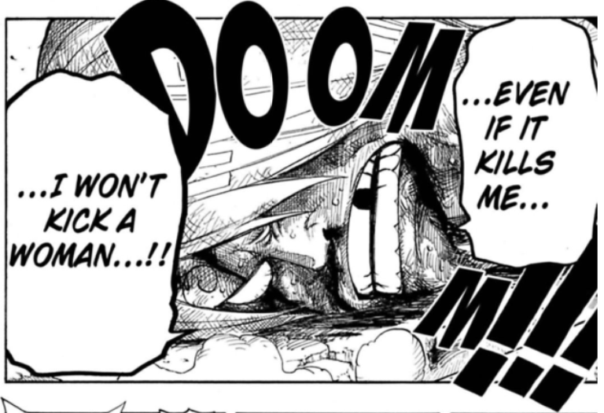
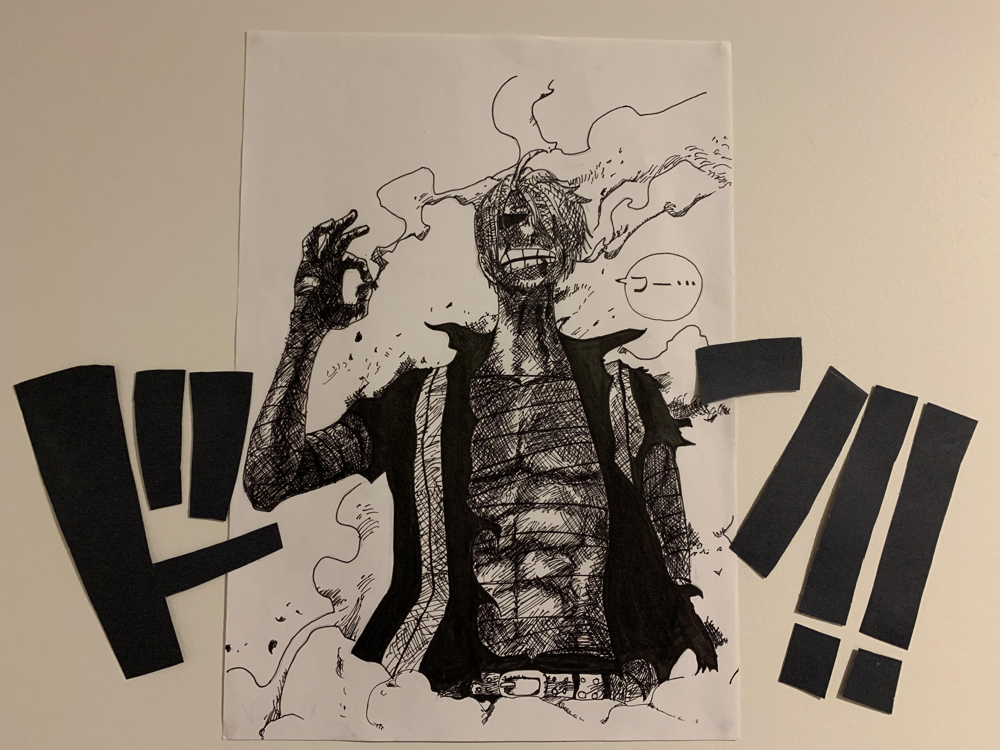

---
authors:
    - prateek11rai
categories:
  - Anime
date: 2025-12-13
draft: false 
---

# Sanji

This site is named after a popular character from the highest selling mange written by Eiichiro Oda called "One Piece". This piece of text is to exaplain why "Sanji" is the best character. [^1]

[^1]: All images used here where picked from the web. Please [contact](mail:prateek11rai@protonmail.com) if you would like to get them taken down :pray:

{ loading=lazy }

<!-- more -->

# The Kindness That was Starved Into Him

Shonen anime is full of tragic backstories, but Sanji’s hits differently. His trauma isn’t framed around power or revenge. It’s hunger. The slow, humiliating kind that eats away at your body and your dignity.

{ loading=lazy }

Sanji's relationship with Zeff is of a dad that he never had. Zeff didn’t just teach Sanji how to fight or cook—he taught him what food means. On that barren rock, when Zeff chose to give up his own leg and every scrap of food so a kid could live, he etched something permanent into Sanji’s soul.

That’s why Sanji feeds everyone. Gin, his enemies, strangers, his crew. His kindness isn’t softness—it’s memory. He knows exactly what it feels like to shrink day by day, to feel your body betray you. In a genre obsessed with brute strength, Sanji’s empathy feels almost radical.

# The Failure of Germa, the Success of Sora

To really understand Sanji, you have to accept one thing: his existence is an act of rebellion.

{ loading=lazy }

Sanji was born into Germa 66, a family that valued strength stripped of emotion. Judge (his father) wanted weapons, not sons. When Sanji showed kindness, fear, and compassion, he was considered defective. Locked in a dungeon, beaten by his brothers, erased from the family name.

But that “failure” was his mother’s victory.

Sora (his mother) knowingly poisoned herself to stop the genetic modifications, sacrificing her life so at least one child could grow up human. Sanji’s emotions are not a coincidence, they’re something his mother died for. Every time Sanji chooses kindness, he is honoring Sora and rejecting Judge. Sanji didn’t just run away. He survived.

# The Tragedy in the Rain

If One Piece ever deserved to be called cinematic, it’s the window scene in Whole Cake Island.

{ loading=lazy }

Sanji had already decided to destroy himself quietly for the sake of his crew. The arranged marriage was a political arrangement, but he convinced himself Pudding (his fiance´e) was not like others.

And then he overheard everything.

Oda didn’t give us a dramatic outburst or a fight. He gave us Sanji standing in the rain, trying to light a cigarette with shaking hands, failing again and again as tears mixed with the downpour. No dialogue. No heroics. Just a man confronting the idea that he was always unlovable—that his father might have been right.

He folds inward. For a character who wears bravado like armor, that moment strips him bare.

# The Hunter in the Shadows

Luffy breaks walls. Zoro cuts through them. Sanji goes around them.

{ loading=lazy }

Sanji has always been the crew’s quiet strategist, the one acting when everyone else is reacting. In Alabasta, he became “Mr. Prince” and played Crocodile from the shadows. In Water 7, while emotions were tearing the crew apart, Sanji was already thinking three steps ahead.

The Sea Train infiltration is one of his defining moments. Alone, outnumbered, no dramatic speeches—just movement. Calculation. Trust in his own judgment. And the famous “Bingo” isn’t just a cool line, it’s the moment where Sanji proves he understands Robin better than she understands herself.

He saves the crew without applause, without recognition, and often without them even realizing they were in danger.

# The Iron Code of Chivalry

Sanji’s refusal to hit women is often treated like a gag, but it’s actually one of the heaviest things he carries.

{ loading=lazy }

That rule comes from Zeff. To Sanji, it’s sacred. If he breaks it, he loses the man who gave him life twice over. That’s why he endures beatings rather than compromise.

But his growth shows in Wano. Against Black Maria, Sanji does something unexpected. He asks for help. He calls Robin. That moment isn’t weakness. It’s trust. Sanji finally understands that his code doesn’t have to be a death sentence. It makes him part of a crew.

# The Aesthetic of Cool (Yes, the Cigarette)

Let’s be honest, Sanji also just looks cool.

{ loading=lazy }

Smoking isn’t healthy, but in the visual language of film and anime, it represents composure under pressure. Sanji’s cigarette is less about rebellion and more about control.

Whether he’s thanking Enel for a light or calmly exhaling after a brutal fight, he carries a kind of stoic energy that feels completely out of place, and perfect for a pirate fantasy.

# Thus... :material-cigar:

He’s a fighter, a chef, a tactician, a romantic, and someone who has been broken more than once, yet he kept getting up. He represents balance: passion and responsibility, kindness and resolve, vulnerability and strength.