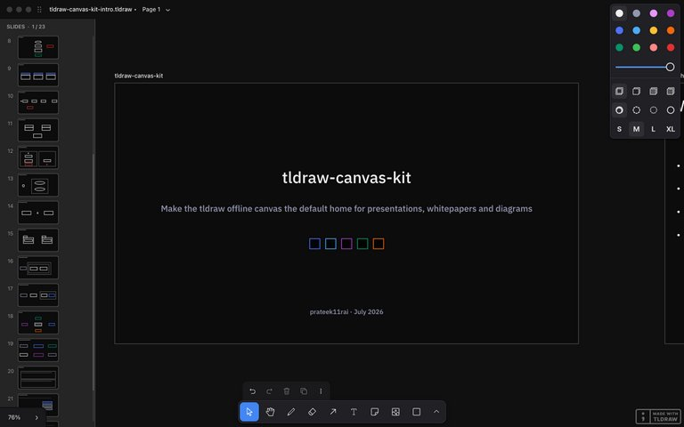
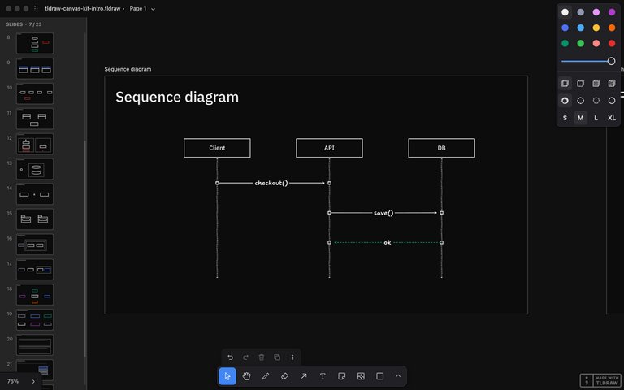
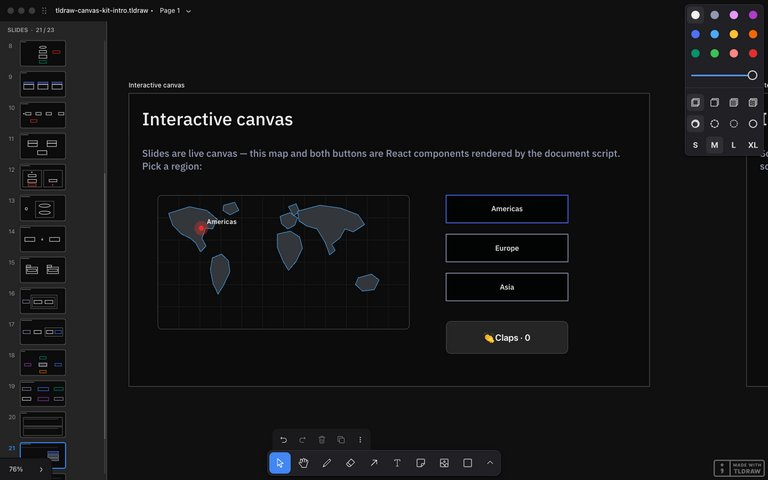
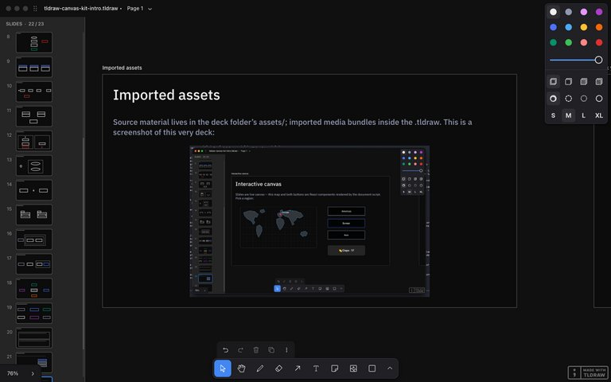
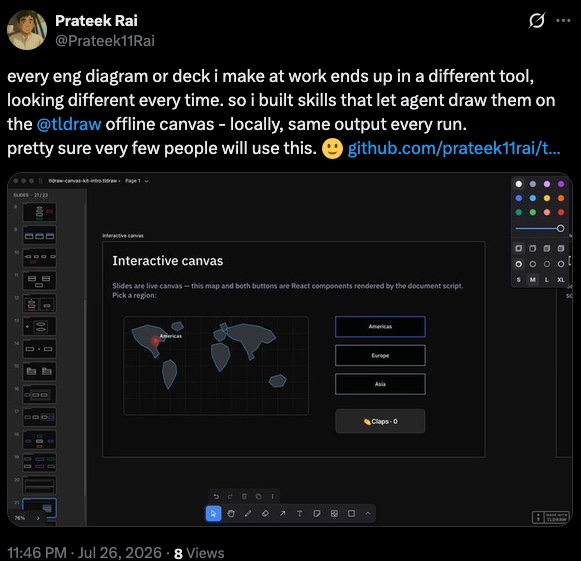

---
authors:
    - prateek11rai
categories:
  - AI
  - Tooling
tags:
  - ai
  - claudecode
  - tldraw
  - agentskills
date: 2026-07-27
draft: false
---

# Same Prompt, Same Diagram — Teaching Agents to Draw on a Local Canvas

At work I keep producing engineering diagrams and the occasional deck. They end up in whatever tool is closest — a whiteboard app here, a slides app there — never consistent, never durable, always one-shot.

I wanted two things: a tool that runs locally, and output that looks the same every single time. So I spent two days teaching coding agents to drive a canvas app, and shipped it as [tldraw-canvas-kit](https://github.com/prateek11rai/tldraw-canvas-kit).

{ loading=lazy }

<!-- more -->

## What It Is

tldraw-canvas-kit is a set of 19 [Agent Skills](https://skills.sh/prateek11rai/tldraw-canvas-kit) that let coding agents — Claude Code, Cursor, Codex, anything the skills CLI supports — drive the free [tldraw offline desktop app](https://offline.tldraw.com) through its local API.[^1] Thirteen diagram types (sequence, flowchart, ER, state, class, activity swimlanes, use-case, component, package, deployment, architecture, mindmap, and a codebase map that reverse-engineers a repo), plus presentations, whitepapers, interactive widgets, export, and theming.

[^1]: tldraw-canvas-kit is an unofficial project, not affiliated with tldraw Inc. The offline app and its local API are theirs, and both are excellent — all credit to the tldraw team.

You describe intent; the skill owns the structure. That division is the whole point.

## Why tldraw Offline

The offline app was the unlock. It runs a local HTTP server — a `server.json` with a port and a per-launch bearer token — so an agent on the same machine can search documents, execute code against a live editor, and install durable scripts into a document. No cloud, no account, no telemetry between me and my diagrams.

Documents are plain `.tldraw` files. And because the app ships its own SDK, scripts bundled into a document need no license key — the behavior travels *inside the file*. Send someone the deck and the filmstrip navigation comes with it.

## Determinism Is the Product

LLMs already know what a sequence diagram is. Ask twice, though, and you get two different layouts, two different arrow styles, two different everythings. What agents lack isn't knowledge — it's consistency.

So each skill is a fixed structure spec: layout math, stencils, stable id schemes, `meta` tagging on every shape the kit creates. The same request produces the same canvas every run.

{ loading=lazy }

Idempotency is load-bearing. Re-running a skill against an existing diagram updates shapes in place, prunes anything the spec dropped, and reconciles edges whose spec changed. That last one was a hard-won bug: my first pass skipped edges whose key already existed, which meant an edge's style could *never* be corrected. The fix — store the full spec in the edge's meta and delete-recreate on mismatch — is now a rule every diagram skill carries.

## Reality Edits the Spec

Every skill was verified against the live app, and the specs got corrected by reality over and over. My three favorite findings:

- **Arrows silently ignore custom dash styles and default to sketchy.** You have to create the arrow, then update it. No error, no warning — your crisp architecture diagram just quietly comes out hand-drawn.
- **Arrows draw straight through intervening shapes, and no lint catches it.** The document validates perfectly while an edge slices through a node's label. Screenshot review became a mandatory verification step because the data model literally cannot see this class of defect.
- **Edge labels wrap mid-word unless the arrow has roughly 30px of length per character.** "deliver" becoming "deliv‑er" across two lines is the kind of thing you only learn by looking.

The pattern across all of them: every failed test became a permanent rule in the skill docs. Test artifacts turned into specifications. The skills aren't what I guessed the API does — they're what the API demonstrably does.

## The Demo Is the Test Suite

The showcase deck has one slide per skill — 23 slides with real mini-diagrams living *inside* the slides: sequence, ER, state machines, three-level-nested deployment zones, a codebase map of the kit's own repo.

It totals 203 shapes and 45 bound edges with zero lint findings, and the builder is deterministic enough that it produced byte-identical counts in two separate documents. So I shipped it as the integration test: `tests/golden-deck/run.sh` rebuilds the deck and asserts exact shape counts, idempotent re-runs, and navigation interactions.

The README gallery and every screenshot in this post are the test output. If the images look right, the test passed.

## There's React in My Canvas

The best discovery of the project: document scripts can import exactly three modules — `tldraw`, `react`, and `react-dom`. Which means custom shape types that render real, clickable HTML on the canvas.

{ loading=lazy }

The deck's interactive slide has a low-poly SVG world map with a graticule and a pulsing region pin driven by a shape prop, next to a claps counter. Actual React components, living inside a `.tldraw` file, surviving save and reopen.

The gotcha that cost me the most time: render closures coalesce rapid clicks. Click a counter five times fast and it increments once, because each handler captured the same stale value. The rule — handlers read fresh store state, never their closure — is now in the widget skill's contract.

## Widgets Are Researched, Not Canned

I surveyed the agent-skills ecosystem while building this, and one gap stood out: skills either ship canned components or nothing. The kit does neither. It ships *contracts* plus a research doctrine — check the live API first, then domain-authority references (tldraw.dev examples, the D3 gallery, MDN), then port into the kit's conventions.

We had a hand-rolled wireframe globe early on. It got deleted from the repo for violating exactly this doctrine — replaced by a researched, location-aware map built at request time.

{ loading=lazy }

The same conventions extend to media: imported screenshots become assets bundled inside the `.tldraw` zip, fit-to-box so they never overflow their slide, and each presentation lives in its own folder with its assets and exports beside it.

## Shipping It

The kit installs two ways: through the skills CLI for 70+ agents, or as a Claude Code plugin with a bundled canvas-operator subagent. Every skill is vendored self-contained, CI checks sync and discovery, commits are signed, and the golden deck is the regression gate.

```bash
npx skills add prateek11rai/tldraw-canvas-kit
```

Links: the [repo](https://github.com/prateek11rai/tldraw-canvas-kit), the [v0.1.0 release](https://github.com/prateek11rai/tldraw-canvas-kit/releases/tag/v0.1.0), and the [skills.sh page](https://skills.sh/prateek11rai/tldraw-canvas-kit).

Honest limits: macOS and Linux only for now (Windows untested — contributions welcome), and the offline app's API is new and unofficial, so things may shift underneath.

## Built for Me

When I [posted about it](https://x.com/Prateek11Rai/status/2081443529944109085), I closed with: pretty sure very few people will use this. It's for me.

That's still the honest framing. I wanted my diagrams to stop moving around between sessions, and now they don't. If a local canvas that agents can drive deterministically is your itch too — it's one `npx` away.

{ loading=lazy }
