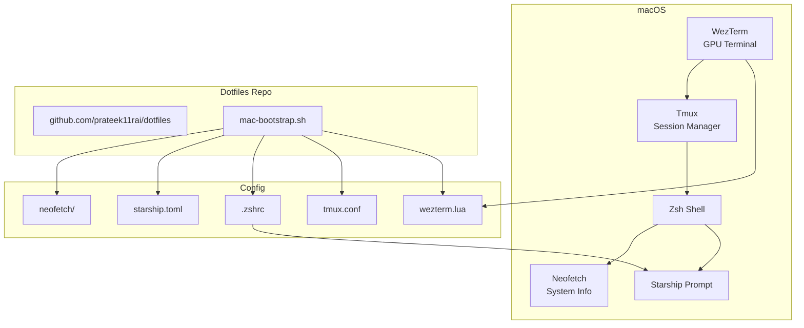

---
authors:
    - prateek11rai
categories:
  - Tooling
tags:
  - wezterm
  - tmux
  - terminal
  - dotfiles
date: 2026-06-06
draft: false
---

# Crafting Your Terminal Like a Chef Sharpens His Knives

I used the default macOS Terminal for years and thought that was just how terminals look.

Then I saw someone else's — proper font, syntax highlighting, a prompt that actually tells you something — and realized mine looked like a hospital monitor from the 90s.

{ loading=lazy }

<!-- more -->

## Why Not the Defaults

macOS ships with Terminal.app and bash (well, zsh now, but the point stands). They are designed to be adequate, not good. Here is what I wanted instead:

| Default | Why It Falls Short |
|---------|-------------------|
| Terminal.app | No GPU acceleration, no Lua config, no cross-platform |
| bash | No autosuggestions, weaker completion than zsh |
| Bare prompt | No git status, no Python version, no command timing |
| No multiplexer | Lose your session when the window closes |
| Default font | Menlo at 12px — designed for legibility, not for staring at 8 hours a day |

I wanted a terminal that felt like my space — configured exactly how I like it, persistent across sessions, and beautiful enough that I do not mind spending hours in it. The result is a stack of four tools that each do one thing well: **WezTerm** for rendering, **Tmux** for session management, **Zsh** for the shell, and **Starship** for the prompt. All tied together with a single dotfiles repo and a bootstrap script that sets up a new Mac in one command.

!!! quote "Hot Take"
    iTerm2 is the default recommendation for anyone switching from Terminal.app, and I think it is overrated. It is heavy, its tab management has always felt bolted on, and its Python scripting API is powerful but unnecessary for 95% of users. WezTerm does everything iTerm2 does but with a config file you can version-control and a GPU-accelerated renderer that actually matters on high-DPI displays.

## WezTerm — The Terminal Itself

[WezTerm](https://wezfurlong.org/wezterm/) is a GPU-accelerated terminal emulator configured entirely through Lua. No GUI settings panel, no hidden preferences — just a `wezterm.lua` file you check into git.[^1]

[^1]: Image credits and attribution — please [contact](mailto:prateek11rai@protonmail.com) if anything needs updating.

### The Config

The main file lives at `~/.config/wezterm/wezterm.lua`, split into modules loaded with `require()`:

```
~/.config/wezterm/
├── wezterm.lua           # Main config
├── startup/
│   └── init.lua          # Auto-attach tmux + maximize on launch
└── keybindings/
    └── init.lua          # Custom keybindings (C-S-f to fit screen)
```

Key settings:

| Setting | Value | Why |
|---------|-------|-----|
| `enable_tab_bar = false` | Off | Tmux handles tabs — WezTerm just renders |
| `window_decorations = "RESIZE"` | Minimal | No title bar, no close/minimize buttons |
| `font = JetBrains Mono Bold` | Bold | Clean, developer-friendly, bold for readability |
| `font_size = 15` | 15px | Comfortable without wasting space |
| `color_scheme = "Dracula (Official)"` | Dracula | Consistent theme across everything |
| `window_background_opacity = 0.99` | Near-solid | Slight transparency for a modern feel |

### The Startup Module

This is the glue that connects WezTerm to Tmux:

```lua
-- ~/.config/wezterm/startup/init.lua
return {
    wezterm.on("gui-startup", function()
        local tmux_path = "/opt/homebrew/bin/tmux"
        wezterm.mux.spawn_window({
            args = { tmux_path, "new-session", "-A" }
        })
    end)
}
```

When WezTerm launches, it runs `tmux new-session -A` — attach to the most recent Tmux session if one exists, or create a new one. The full path to `tmux` is required because WezTerm's spawn process does not inherit the user shell PATH.

### The Keybindings Module

```lua
-- ~/.config/wezterm/keybindings/init.lua
return {
    keys = {
        {
            key = "F",
            mods = "CTRL|SHIFT",
            action = wezterm.action({ FitToDisplay = {} }),
        },
    }
}
```

One binding: `Ctrl+Shift+F` fits the window to the active display. This exists because disconnecting an external monitor leaves the terminal window sized for a larger screen. One keystroke fixes it.

## Tmux — The Session Manager

WezTerm renders the pixels. Tmux keeps your work alive. The two together are better than either alone.[^2]

[^2]: WezTerm has its own multiplexer, but Tmux is preferred because sessions persist when the window closes, it works identically over SSH, and it has decades of community tooling around it.

Config at `~/.config/tmux/tmux.conf`:

```text
set -g prefix C-a                # Changed from C-b — easier reach
set -g mouse on                   # Click panes, scroll, resize with mouse
bind r source-file ~/.config/tmux/tmux.conf  # Quick reload
bind i run ~/.config/tmux/plugins/tpm/bin/install_plugins
```

### Plugins

Managed by TPM (Tmux Plugin Manager):

| Plugin | Purpose |
|--------|---------|
| `tmux-plugins/tpm` | Plugin manager itself |
| `tmux-plugins/tmux-sensible` | Saner defaults (better escape time, UTF-8, improved pane behavior) |
| `tmux-plugins/tmux-yank` | Copy to system clipboard from inside tmux |

### Why Tmux Over WezTerm Tabs

WezTerm can do tabs natively. I chose Tmux because:

1. **Persistence** — close WezTerm, reopen it, and you are back in the same Tmux session. Everything is where you left it.
2. **SSH** — Tmux works over SSH exactly as it works locally. Detach from a remote session, reconnect later from a different machine.
3. **Muscle memory** — Tmux has been doing this since 2007. Every terminal multiplexer since then has been catching up.

## Zsh — The Shell

The shell config at `~/.zshrc` sets up the environment that WezTerm and Tmux run inside:

```bash
# Prompt
eval "$(starship init zsh)"

# Python
export PYENV_ROOT="$HOME/.pyenv"
command -v pyenv >/dev/null && eval "$(pyenv init -)"

# Editor
export EDITOR="code --wait"

# Autosuggestions
source "$(brew --prefix)/share/zsh-autosuggestions/zsh-autosuggestions.zsh"

# Java
export JAVA_HOME="/Library/Java/JavaVirtualMachines/jdk-22.jdk/Contents/Home"

# Corporate SSL (Netskope — only on work machines)
if [ -f "/Library/Application Support/Netskope/STAgent/stagent.pem" ]; then
    export AWS_CA_BUNDLE="/Library/Application Support/Netskope/STAgent/stagent.pem"
    export CURL_CA_BUNDLE="/Library/Application Support/Netskope/STAgent/stagent.pem"
    export SSL_CERT_FILE="/Library/Application Support/Netskope/STAgent/stagent.pem"
    export NODE_EXTRA_CA_CERTS="/Library/Application Support/Netskope/STAgent/stagent.pem"
fi

# Aliases
alias vc="vcluster platform connect vcluster"
alias ap="argopm install . -n default -f -c ."
```

The Netskope block is only active on corporate machines where the cert file exists. On personal machines, those env vars are never set, and nothing breaks.

## Starship — The Prompt

[Starship](https://starship.rs) is a cross-shell prompt written in Rust. It is fast, minimal, and shows contextual information without clutter.

```toml
# ~/.config/starship.toml
# Each module gets its own format string
[git_branch]
format = "on [$symbol$branch]($style) "

[python]
format = "via [${symbol}${version}]($style) "

[cmd_duration]
show_milliseconds = true
```

What it shows on every prompt:
- **Current directory** — truncated to fit
- **Git branch and status** — dirty/clean, ahead/behind
- **Python version** (if in a venv or project)
- **Command duration** — how long the last command took
- **Exit code** — red indicator on failure

## The Dotfiles Repository

Everything above lives in a single repo: [`github.com/prateek11rai/dotfiles`](https://github.com/prateek11rai/dotfiles)

The structure mirrors `~/.config/` directly:

```text
dotfiles/
├── .zshrc
├── .config/
│   ├── starship.toml
│   ├── tmux/tmux.conf
│   ├── neofetch/
│   │   ├── config.conf
│   │   └── custom-ascii.txt
│   └── wezterm/
│       ├── wezterm.lua
│       ├── startup/init.lua
│       └── keybindings/init.lua
├── wallpapers/macos.png
├── scripts/mac-bootstrap.sh
└── README.md
```

### The Bootstrap Script

The script at `scripts/mac-bootstrap.sh` automates setting up a new Mac:

1. Install Homebrew (if missing)
2. Install packages: `tmux`, `starship`, `gh`, `zsh-autosuggestions`, `pyenv`, `wezterm`, `font-jetbrains-mono`, `neofetch`
3. Back up any existing config files that are NOT already symlinks (renames to `.backup.YYYYMMDD-HHMMSS`)
4. Symlink every config file from the repo into the correct `~/` or `~/.config/` location
5. Install TPM and Tmux plugins

Running it on a fresh Mac:

```bash
git clone https://github.com/prateek11rai/dotfiles.git ~/github/prateek11rai/dotfiles
~/github/prateek11rai/dotfiles/scripts/mac-bootstrap.sh
```

The backup step makes this safe to run on an already-configured machine — nothing gets lost.

## The Architecture



!!! info "Neofetch is Archived"
    Neofetch has been unmaintained since 2023. The bootstrap script falls back to downloading the raw script from GitHub if `brew install` fails. Consider migrating to `fastfetch` as a maintained replacement.

## What It Looks Like

{ loading=lazy }

WezTerm opens, attaches to the last Tmux session, and I see my Zsh prompt with the Dracula theme, Starship showing git status, and Neofetch greeting me with system info. Everything is the same as I left it — even if I closed the terminal an hour ago, on a different display, in a different city.

## The Philosophy

Five principles that shaped this setup:

1. **Tmux-first** — Tmux manages sessions, not the terminal. WezTerm is just a display layer. This separation means I can close the window, switch machines, or lose power without losing my place.
2. **One config repo** — All dotfiles in one place, one bootstrap script, one `git clone` to set up a new machine.
3. **Minimal bootstrap** — Only Homebrew and git needed to go from zero to fully configured.
4. **Consistent theme** — Dracula everywhere. Same colors in the terminal, editor, and browser. Reduces visual friction.
5. **Safe to re-run** — The bootstrap script backs up existing files before symlinking. I can run it on an already-configured machine without breaking anything.

Every chef has their own knife kit, sharpened and arranged exactly how they like it. This is mine. WezTerm is the blade, Tmux is the workbench, Zsh is the cutting board, and Starship is the scale that tells you exactly what you are working with. The dotfiles repo is the roll that keeps it all together.
