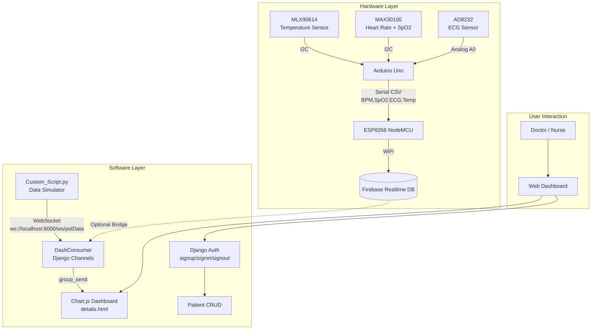
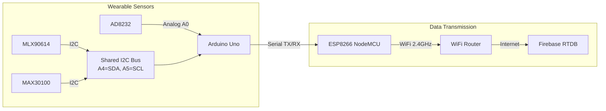
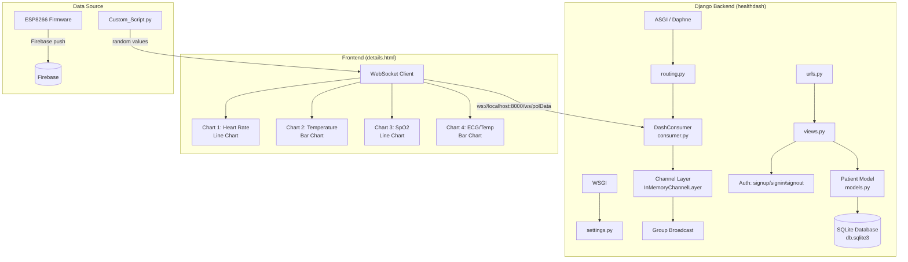
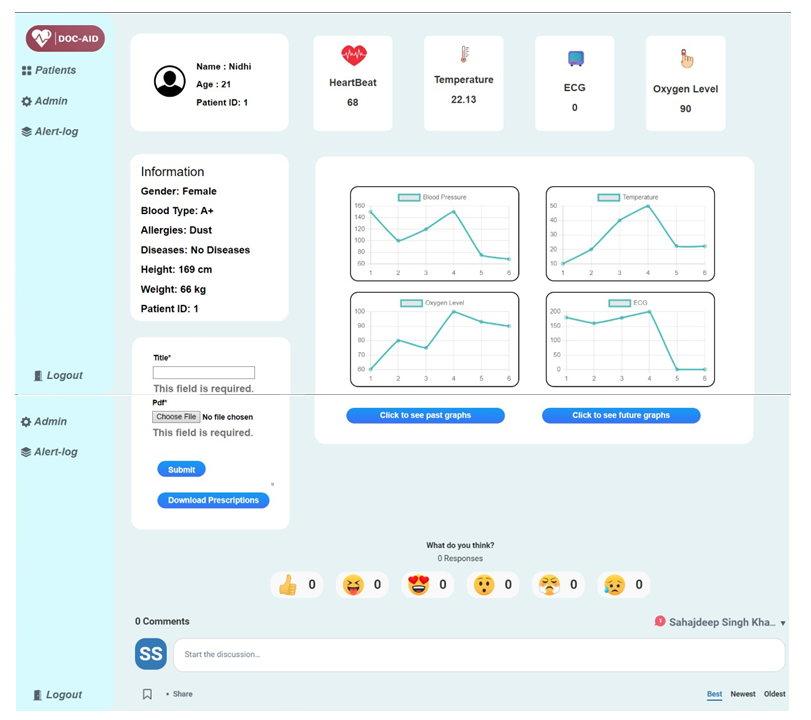
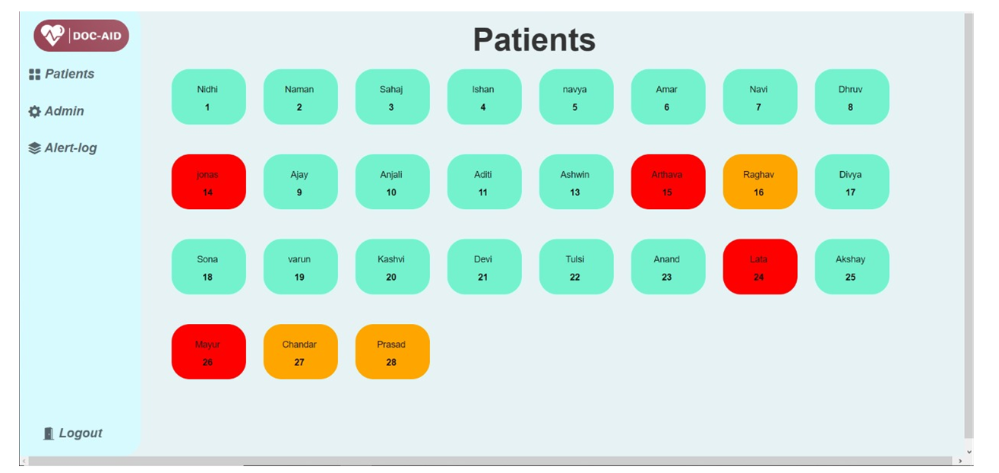

---
hide:
  - feedback
---

# :material-heart-pulse: DocAid

[:material-source-repository: Source Repo](https://github.com/prateek11rai/DocAid){: .report-pill target="_blank" rel="noopener noreferrer" } [:material-file-document-outline: View Report](https://github.com/prateek11rai/DocAid/blob/main/assets/report.pdf){: .report-pill target="_blank" rel="noopener noreferrer" }

> An IoT wearable health monitoring system with a real-time hospital management dashboard. Capstone project submitted at Thapar University, 2023.

## :material-hospital-box: The Problem

Hospital patient monitoring today is wired, stationary, and expensive. Bedside monitors track vitals but tether patients to their beds. Nurses do manual rounds to log readings. There is no continuous data stream — just snapshots. And the hardware costs more than most hospitals in developing regions can afford.

DocAid was built to prove that a working patient monitoring system could be assembled for under :material-counter: **$50** in components, stream data to the cloud in real time, and display it on a live web dashboard accessible from any device in the hospital.

## :material-monitor-dashboard: What It Does

The system reads four vitals simultaneously — heart rate, SpO2, ECG, and body temperature — from sensors worn by the patient. An Arduino Uno collects the data and passes it over Serial to an ESP8266, which pushes it to Firebase over WiFi. A Django web application with Django Channels receives the stream and renders live, updating Chart.js charts on a patient dashboard.

A simulation script (`Custom_Script.py`) replicates the exact hardware data format, enabling full-stack development and testing without any physical components connected.

## :material-sitemap-outline: System Architecture

### High-Level Overview

### :material-chip: Hardware Detail

### :material-layers-outline: Software Detail

## :material-wrench: Hardware

### :material-list-box-outline: Components

| Component | Price | Purpose | Interface |
|-----------|-------|---------|-----------|
| :material-chip: Arduino Uno | ~$25 | Microcontroller, reads all sensors | 5V logic, 16MHz, I2C/SPI/UART |
| :material-wifi: NodeMCU ESP8266 | ~$5 | WiFi SoC, pushes data to Firebase | 3.3V logic, 802.11 b/g/n |
| :material-heart: MAX30100 | ~$5 | Heart rate + SpO2 | I2C (0x57) |
| :material-waveform: AD8232 | ~$10 | ECG signal conditioning | Analog out, 100x gain |
| :material-thermometer: MLX90614 | ~$10 | Non-contact temperature | I2C (0x5A), -70 to 380°C |

### :material-connection: Wiring

| Sensor | Uno Pin | Notes |
|--------|---------|-------|
| MLX90614 VIN | 5V | — |
| MLX90614 SCL | A5 | Shared I2C clock |
| MLX90614 SDA | A4 | Shared I2C data |
| MAX30100 VIN | 3.3V | Check module variant |
| MAX30100 SCL | A5 | Shared with MLX90614 |
| MAX30100 SDA | A4 | Shared with MLX90614 |
| AD8232 OUTPUT | A0 | ECG analog output |
| AD8232 LO- | D11 | Leads-off detect negative |
| AD8232 LO+ | D10 | Leads-off detect positive |
| Uno TX | ESP8266 RX | Serial at 115200 baud |

{ loading=lazy }

### :material-chart-bell-curve: Sensor Characteristics

| Reading | Typical Range | Accuracy | Limitations |
|---------|--------------|----------|-------------|
| Heart Rate | 60-100 BPM | ±2 BPM | Motion artifacts; needs stable contact |
| SpO2 | 95-100% | ±2% | Fingertip placement critical |
| ECG | 0-5mV (raw: 300-600 ADC) | Diagnostic quality | Good electrode contact required |
| Temperature | 36-38°C | ±0.1°C | Ambient temp affects reading |

## :material-code-tags: Software Stack

### :material-server: Backend

| Component | Technology | Purpose |
|-----------|-----------|---------|
| Web Framework | Django 4.0.1 | Backend application server |
| ASGI Server | Daphne 4.0.0 | HTTP + WebSocket server |
| WebSockets | Django Channels 4.0.0 | Real-time bidirectional communication |
| Channel Layer | InMemoryChannelLayer | In-process message broker |
| Database | SQLite | Development database |
| Auth | Django built-in auth | Username/password, session-based |

### :material-monitor: Frontend

| Component | Technology | Purpose |
|-----------|-----------|---------|
| Templates | Django Template Language | Server-rendered HTML |
| Real-time Charts | Chart.js (CDN) | 4 live updating charts |
| CSS Framework | Bootstrap 3 + Custom CSS | Responsive layout |
| WebSocket Client | Native JavaScript WebSocket API | Bidirectional connection |

### :material-chip: Firmware

| Component | Technology | Purpose |
|-----------|-----------|---------|
| Arduino Board | Arduino AVR Boards 1.8.6 | Uno support |
| ESP8266 Board | ESP8266 Community 3.1.2 | NodeMCU support |
| Temperature | Adafruit_MLX90614 | Sensor driver |
| Pulse Oximeter | MAX30100_PulseOximeter | HR + SpO2 algorithm |
| Firebase | FirebaseArduino | RTDB push API |
| NTP Client | NTPClient | Network time sync (IST, UTC+5:30) |

## :material-transfer: Data Flow

1. **Sensor Acquisition**: MLX90614 and MAX30100 communicate over I2C on A4/A5. AD8232 outputs analog ECG on A0.
2. **Uno Processing**: Reads all sensors every 10 seconds. Combines into CSV: `BPM,SpO2,ECG_raw,Temp_C`. Prints to Serial at 115200 baud.
3. **ESP8266 Relay**: Reads CSV from Serial, timestamps via NTP, pushes to Firebase at `/Patient_1/<timestamp>`.
4. **Firebase Storage**: Data stored as strings under timestamped keys — available for downstream analytics.
5. **Django WebSocket Pipeline**: `Custom_Script.py` sends random 4-value JSON → WebSocket → DashConsumer → group broadcast → Chart.js.
6. **Frontend Rendering**: 4 real-time charts update on every message (6-point sliding window via `shift()`/`push()`).

## :material-lightbulb-outline: Key Decisions

### Two Microcontrollers (Not One)
The Uno handles sensor reads while the ESP8266 handles WiFi/Firebase. The ESP8266 has fewer reliable analog pins and the Uno has better I2C stability. They talk over Serial UART at 115200 baud. This also means the sensor loop runs uninterrupted if WiFi drops.

### CSV Over Serial
The Uno sends comma-separated `BPM,SpO2,ECG,Temp` rather than JSON. Saves bytes on the limited Serial buffer and avoids needing a JSON library on the resource-constrained Uno.

### Firebase as the Bridge (Deliberately Left Out)
The Firebase-to-Django bridge is not included in the repository — the Django side works independently with the simulation script. This enables others to set up their own Firebase project with custom security rules.

### Simulation Script for Dev Workflow
`Custom_Script.py` sends random but realistic-range values every 5 seconds, enabling full dashboard testing without any hardware connected.

## :material-image-multiple-outline: Screenshots

{ loading=lazy }
{ loading=lazy }

## :material-source-repository: The Repo

Full source code and firmware available on GitHub:

[:octicons-mark-github-16: prateek11rai/DocAid](https://github.com/prateek11rai/DocAid)

---

:material-account-hard-hat: Capstone project submitted at **Thapar University, 2023**. Built as a prototype to demonstrate real-time IoT health monitoring.

