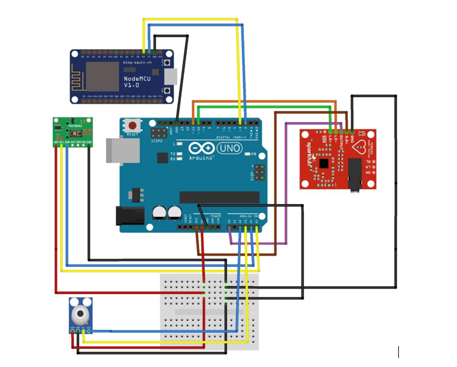

---
hide:
  - feedback
---

# Projects

-   :material-heart-pulse:{ .lg .middle } __DocAid__

    ---

    { .card-figure loading=lazy }

    Capstone project combining an IoT wearable (Arduino + health sensors) with a real-time Django/Channels dashboard for hospital patient monitoring. Submited at Thapar University, 2023.

    [:octicons-arrow-right-24: More Details](./doc-aid/index.md)

<!-- Card template for the next project — image classes: .card-cover
     (screenshot, crops to fill 16:9) or .card-figure (diagram, shown
     whole on a white plate). Keep exactly one link per card: the CSS
     stretches it over the whole card and hides its text.

-   :material-robot:{ .lg .middle } __Project Name__

    ---

    { .card-cover loading=lazy }

    One or two sentence description.

    [:octicons-arrow-right-24: More Details](./<slug>/index.md)
-->

<!-- -   :fontawesome-brands-markdown:{ .lg .middle } __It's just Markdown__

    ---

    Focus on your content and generate a responsive and searchable static site

    [:octicons-arrow-right-24: Reference](#)

-   :material-format-font:{ .lg .middle } __Made to measure__

    ---

    Change the colors, fonts, language, icons, logo and more with a few lines

    [:octicons-arrow-right-24: Customization](#)

-   :material-scale-balance:{ .lg .middle } __Open Source, MIT__

    ---

    Material for MkDocs is licensed under MIT and available on [GitHub]

    [:octicons-arrow-right-24: License](#) -->

